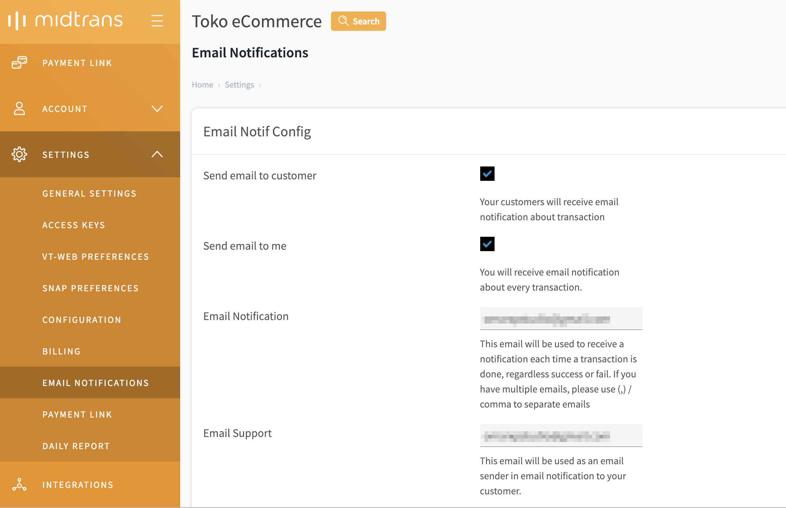
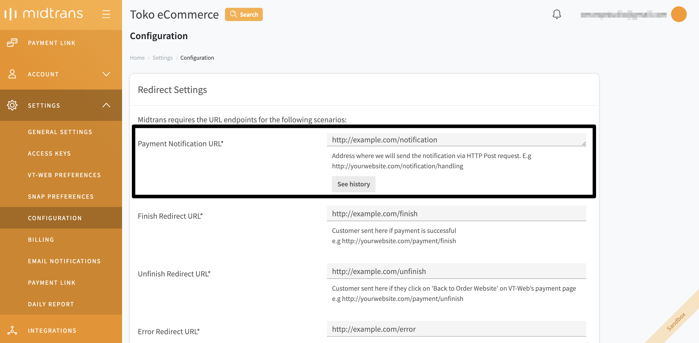

## Transaction Status

After payment has been completed by customer (payment confirmed on Midtrans). Merchant will be notified by Midtrans, also Merchant can also retrieve transaction status to Midtrans.

Midtrans provides three means for merchant to obtain the transaction status:

1. Email Notification
2. HTTP(S) Notification / Webhook
3. Merchant Administration Portal

## Email Notification

On transaction status changes: success, failure, cancel, etc. Midtrans by default will notify by email the status of the transaction to Merchant email (email configured on dashboard) & Customer email (email inputted on Snap payment page). 

Merchant can configure the email notification setting at [Settings - Email Notification](https://dashboard.sandbox.midtrans.com/settings/email_notifications) in Dashboard.

?> For multiple emails, please use comma as a separator. Example : `me@tokoecomm.com, you@tokoecomm.com`

## HTTP(S) Notification / Webhook

Notification through HTTP(S) POST / Webhook will be sent to the merchant's server when customer completes the payment process and when transaction status changes (transaction refunded, pending, etc). Merchant can utilize the HTTP(S) POST notification to update a payment status or send the item of a transaction in real time.

Enable Midtrans HTTP(S) POST Notification by setting the Payment Notification URL at [Settings - Configuration](https://dashboard.sandbox.midtrans.com/settings/vtweb_configuration/). URL protocol prefix  (`https://` or `http://`) are required, we highly recommended to use `https://` to ensure security.

!> Make sure to input Notification URL that **can be reached from Public Internet**. Midtrans **will not be able** to send notification to localhost, private/auth/password protected url, url behind VPN, unusual destination port, etc. Though don't worry, you can then utilize `signature_key` or method explained below to make sure it's security.