The general usage of Dashboard or Merchant Administration Portal (MAP) will be explained below.

The initial page is the dashboard. On this page, you can see information on transaction volumes, most used payment methods, as well as the level of acceptance of transactions that occur, etc.

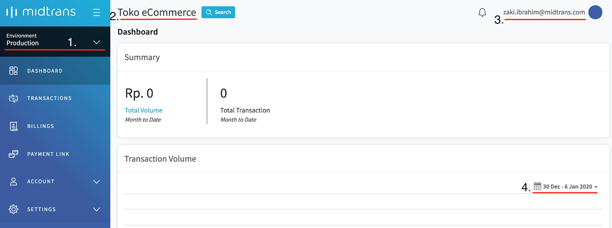

1. Environment toggle. You can switch between sandbox and production environment from the button on the top left of your MAP
2. The merchant name that registered in Midtrans.
3. The email address that to using login to MAP.
4. The date range to see / filter transactions.

?> Transaction data is retained on MAP for 6 months. Please contact your Midtrans PIC if you are looking for data beyond that limit.

## Transaction Management
Transaction page is the main page where merchants can see all transactions that recorded on Midtrans Administration Portal. On this page the merchant can see the status of transactions, manage, search, and download the report.

#### Search Transaction (1)
We strive to make it simple for merchant to search transactions. With search feature, you can filter the transactions by Transaction Time, Settlement Time, Transaction Status, Payment Type, and many more useful fields.

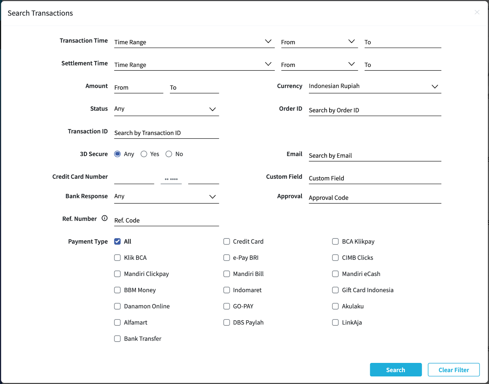

#### Download Transaction (2)
This button will allow you send transaction report to the current email address used to login. To customize report, you can filter content by checking through the available checkboxes. Please check your inbox (also Spam folder if necessary) afterwards, to retrieve the report.

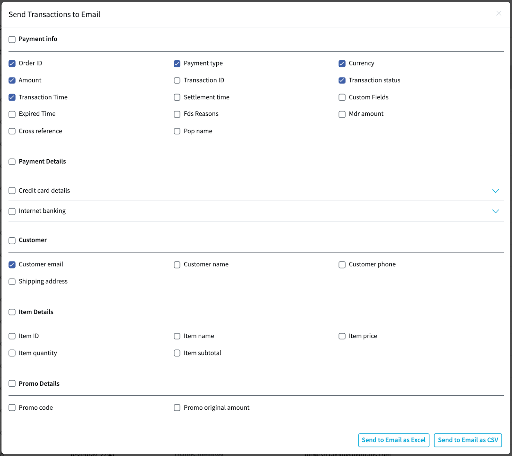

#### View Transaction Status (3)
Transaction status is displayed on the right side on the transaction list table.

### Transaction Details
Merchants can see the details of transactions that are recorded on MAP. Click **order_id** of the transaction then you will be shown the transaction details page below.

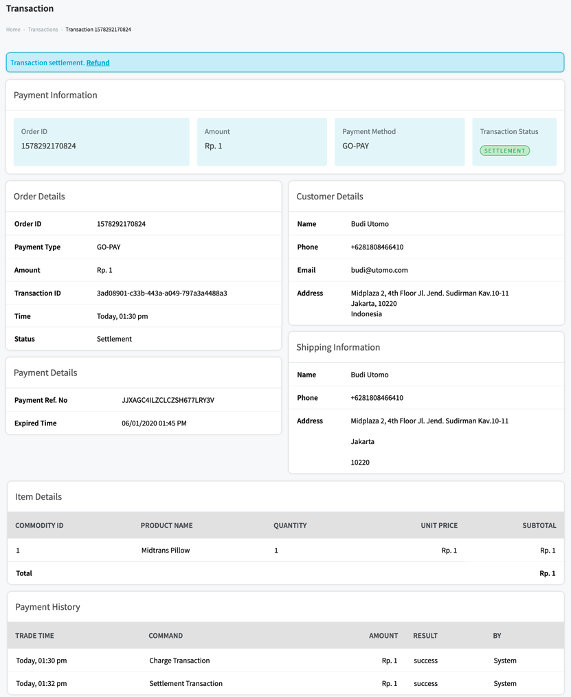
<!-- TODO elaborate more? explain important things -->

### Transaction Action 
On some transactions, you can see the possible actions that you can take to that transaction. Like cancel, refund and challenge. 

#### Challenge Transaction: Accept / Deny
When the transaction triggers indication of potential fraud activity it will be detected by Midtrans’s FDS (Fraud Detection System). **Challenge** status is returned when a transaction (i.e. typically a card transaction) has been successfully authorized, but it is flagged by our fraud prevention system. It does not mean that the transaction is fraudulent but may require further review. 

After reviewing the transaction, merchant can either click **Accept** or **Deny** the aforementioned **Challenge** transaction. Any **Challenge** transaction that is neither accepted nor denied will be automatically denied during settlement time. Merchant can click ℹ symbol to see the reasons why the transaction triggers a challenge status.

#### Refund Transaction

If you want to refund a transaction, you can click the **refund**  action button above the transaction details. You must fill the amount field, the refund amount can be filled with full or partial amount, the reason field is optional.

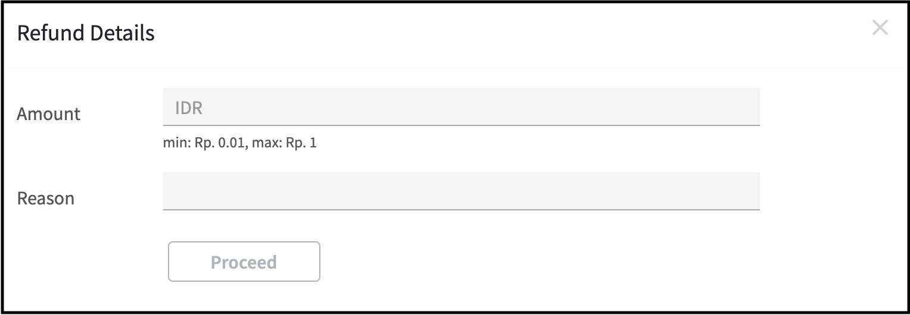

?> Not all transaction are available to be refunded via Dashboard due to payment provider's capability and agreement model, please contact your Midtrans PIC for further details on which kind of transaction is available for refund via Dashboard.

#### Cancel Transaction
To cancel a transaction, you can click the **Cancel** button. Transactions that can be canceled are transactions that are on  **Success** or **Pending** status

## Account
Account menu have some important functionalities that can help merchant manage their account. Under this account management menu, you can create a new user, change roles, view log activities, etc.

### User Profile
You can change your (currently used to log in) profile, such as name, phone number and password. In addition, you can also activate the two-factor authentication feature.

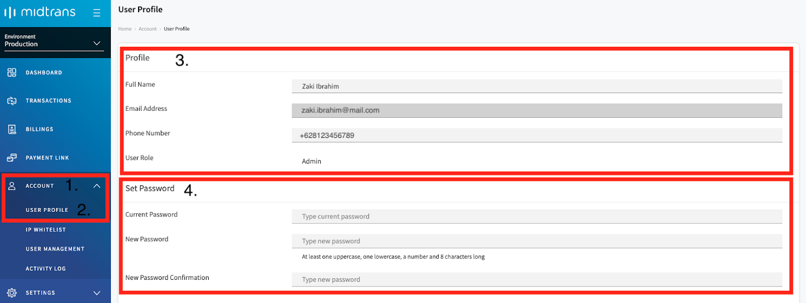

#### Two Factor Authentication
Two-factor authentication or 2FA is an additional security feature with the aim of adding additional verification of whether the user entering the MAP is the right person to have the account. You can use Google **Authenticator** (or other alternative Authenticator) application for the 2FA feature on Midtrans.

### IP Whitelist
Security features that will allow MAP to be accessible only through the IP addresses specified in this page. If someone tries to login with an unlisted IP address, he will not be granted access.

!> Make sure you **use a static IP** from your internet provider. If you use **dynamic IP address** from an internet provider, **there is a possibility** that your **access to the MAP will be lost** because your IP may be changed depending on the internet provider assignment. Please make sure you are inputting correct IP address before adding it to the whitelist. 

Useful if for example you only allow MAP access from your office’s static IP address. But if you are accessing MAP from a mobile internet provider IP address, it is not recommended, since most probably you will be using dynamically changing IP addresses.

### User Management
MAP allows merchant to add new user with various roles. Go to **Account (1) > User Management (2)**, then add new users and specify their roles from here. Also you can also edit and delete user in this section, by clicking edit / delete.

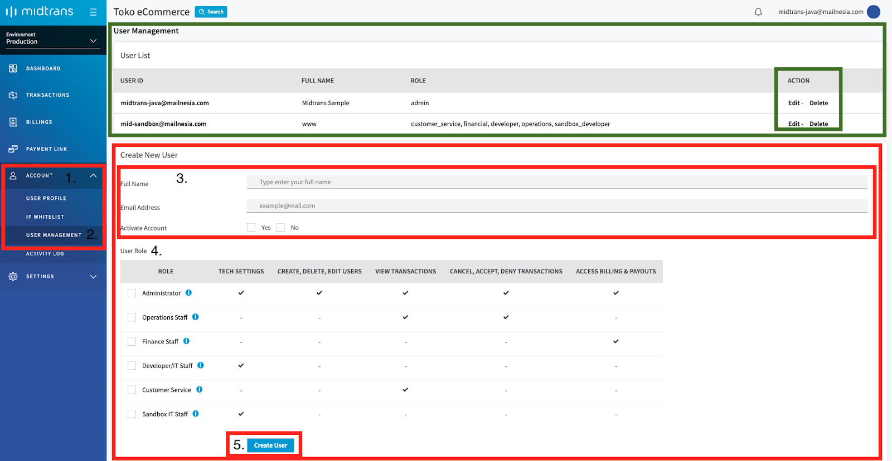

You can see each role's authorized functionalities on the displayed table.

Role Name | Description / Function
--- | ---
Administrator|Has access to all MAP menu, usually reserved for business Owner CEO / GM 
Operation Staff|Have access to transaction information and status. Can cancel (void), Accept / Deny transaction.
Finance Staff|Access to billing related information. Can do payout and edit billing information.
Developer / IT Staff|Access to technical configurations
Customer Service|Access to transaction information status only
Sandbox IT Staff|Same as developer, but Sandbox only

### Activity Log
With more user added to access MAP, you may need a feature that can see the activities of these accounts. In this menu, merchants can see all activities carried out by accounts that have been registered under their MAP. Information that can be seen includes:
- User
- IP address
- Action taken
- Time

In addition, we also provide a search feature, making it easier for merchant to find activity logs from specific accounts.

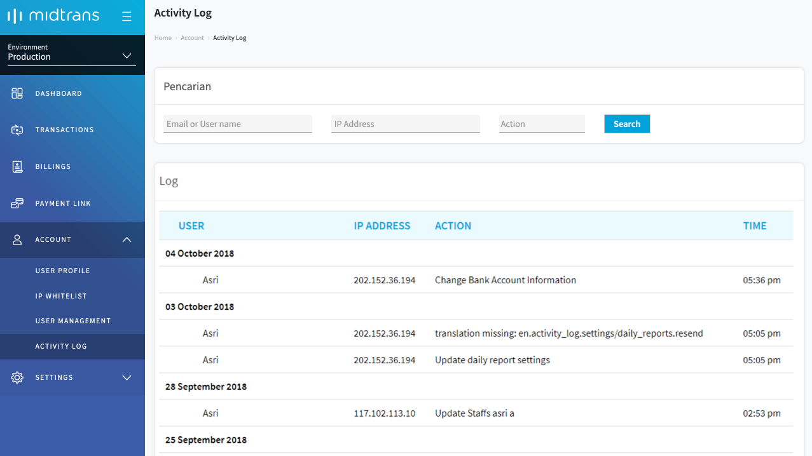

## Settings
<!-- TODO add settings > configuration menu -->

### General Settings
Available under menu **Settings > General Settings** It is recommended to complete the general information about your business in this section. Please follow the form displayed on the page.

### Access Keys
Usage of this menu is [explained on this section](/en/midtrans-account/overview.md#retrieving-api-access-keys)

### Snap Preferences
Merchants can set up preference SNAP pages on this menu. You can upload logo, change theme color, activate / deactivate payment methods, and change language preference.

#### Theme and Logo
Midtrans provides various available colors for SNAP payment page, merchants can also add merchant logo.

#### Manage Active Payment Methods
You can set Enable Payment with Snap Preference on Midtrans Dashboard. This will apply to all Snap transaction for the Merchant account.

1. Login to your Midtrans Dashboard
2. Go to menu **(1) Settings -> (2) Snap Preferences -> (3) Payment Channels Tab**
3. Click [x] icon to disable payment channel
4. Click [+] icon To enable payment channel
5. To use our recommendation sorting, Click "Apply Recommended Sorting" button and also you can drag/drop manually to sorting payment channel list
6. Click **Save** button

#### Bank Transfer: Bank List
Currently Midtrans supports Bank Transfers via several banks: BCA, BNI, Mandiri, Permata and payment through the ATM Bersama, ALTO and Prima networks. Under **Bank List** merchant can arrange the payment methods via Bank Transfer. It is possible to change the bank processor on Payment channel of **Other Bank**, there are two available bank processors for Other bank payment channels Permata and BNI.

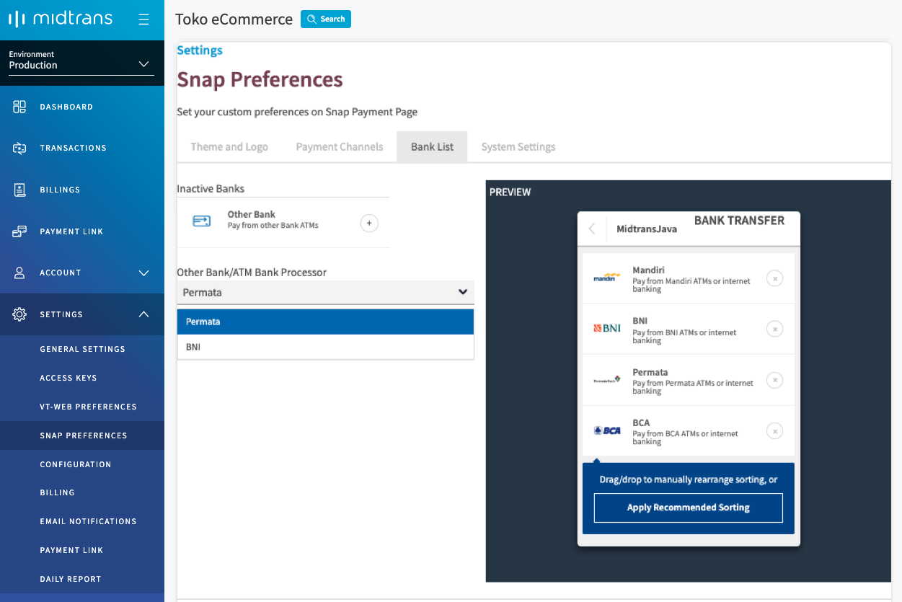

Payment List on Snap|Payment Method|Description
--- | --- | ---
Bank Transfer - BCA|BCA Virtual Account|Payment via BCA Channel
Bank Transfer - Mandiri|Mandiri Bill Payment|Payment via Mandiri Channel
Bank Transfer - Permata|Permata Virtual Account|Payment via Permata Channel
Bank Transfer - BNI|BNI Virtual Account|Payment via BNI Channel
Bank Transfer - Other Bank|Permata VA / BNI VA|Payment via ATM Bersama, ALTO and Prima networks

#### System Settings
You can set custom expiry under Snap Preference on Midtrans Dashboard:
1. Login to your Midtrans Dashboard
2. Go to **(1) Settings -> (2) Snap Preferences -> (3) Tab System Settings**
3. Click **Checkbox (4)** on the left side duration field to enable custom expiry
4. Fill in the expiry duration (5).
5. Select duration unit on the dropdown menu (6)
7. Click **Save** button

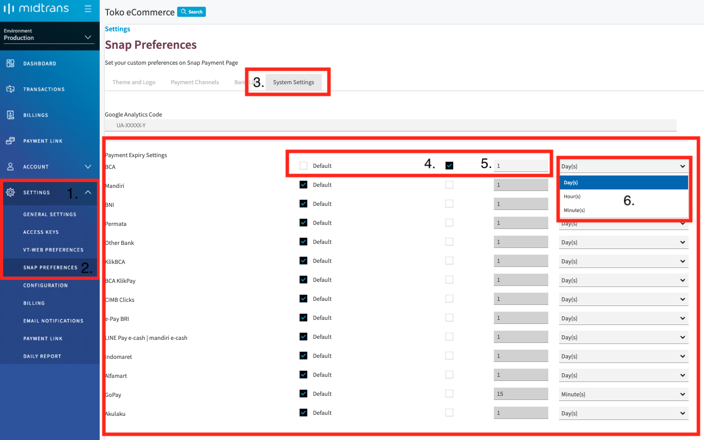

### Email Notifications
Midtrans provides email notification for the merchant and customer to receive the transaction status. It will be sent to the email address on **Email Notification** configured in MAP when the transaction status changes. You can configure the email notification setting under the **Email Notification** menu in MAP. (This feature is **enabled by default**).
1. Login to your Midtrans Administration Portal.
2. Go to **Settings (1)  - Email Notifications (2)**
3. Check the **send email to customer** checkbox (3) if you want to enable email notification to customer. When transaction status changes, they will receive notification about the transaction.
4. Check the **email notification** checkbox (4), and fill in your email address (5). You can fill with multiple emails, please use comma as a separator. Example : email-id-1@myemail.com, email-id-2@myemail.com
5. Fill **Email Payout Report** (6) with your desired email address to receive a report of payout.
6. Click **Save Preferences (7)**

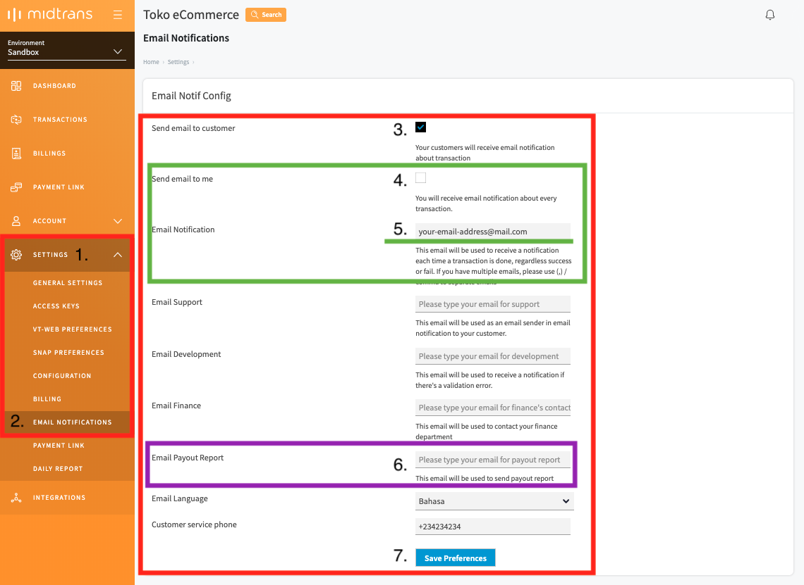

### Disable Payment Link
To disable/enable [Payment Link](/en/payment-link/overview.md), you can configure it under **Settings > Payment Link** menu.

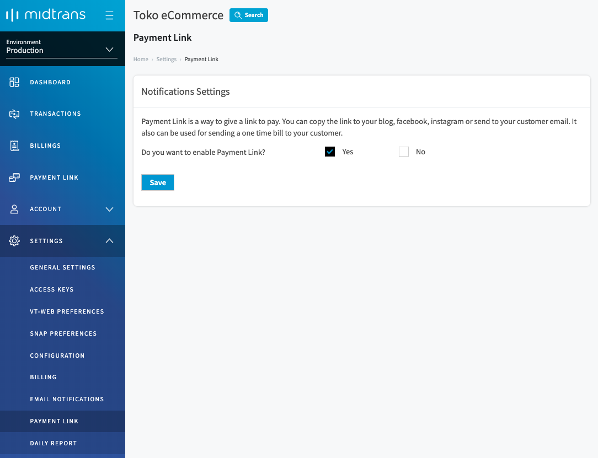

### Daily Report
In the daily report configuration, you can choose what information will be available on the daily report. Merchant can also disable the daily report feature. It is also possible to send daily reports to several email addresses at once. 

Here is how to configure the daily report:
1. Login to your Midtrans Administration Portal.
2. Click **Settings (1)  - Daily Report (2)**
3. Check the Yes checkbox (3) if you want to enable email daily report.
4. Fill in the email address, you can also send the daily report to multiple emails, use comma as a separator. Example : email-id-1@myemail.com, email-id-2@myemail.com
5. Select  **Information field (4)** that you want to show in your daily report.
6. Click **Save Preferences (5)**

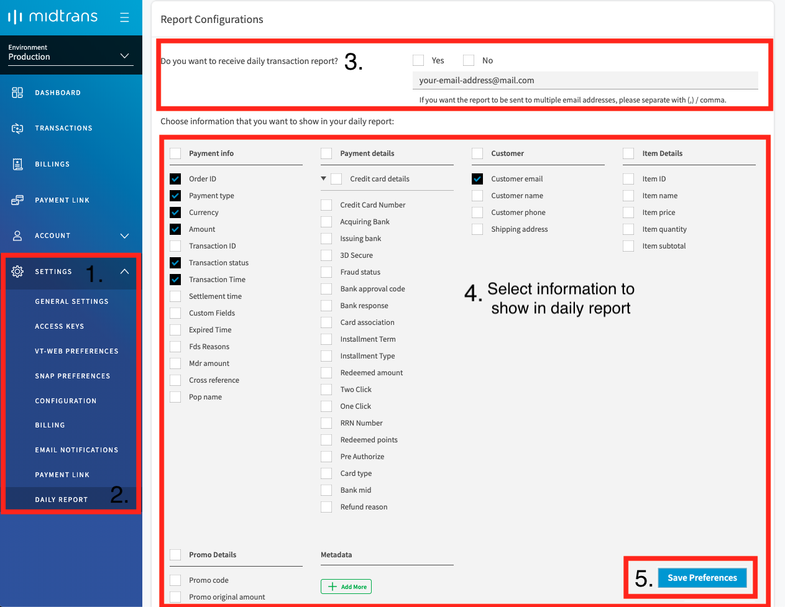

On the page below the daily report, merchants can resend the Daily Report by selecting the date of the daily report that you want to resend and click send.

