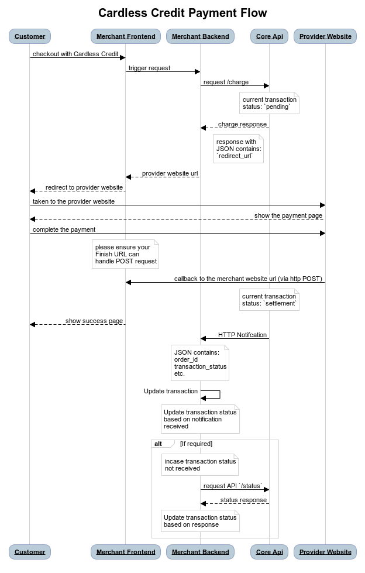

# Cardless Credit
<hr>
One of the payment method offered by Midtrans is Cardless Credit. By using this payment method, customers will have the option to make a payment via Cardless credit page and Midtrans will send real time notification when the customer complete the payment.

At this moment, Midtrans has integrated with 


Basic integration process of Cardless Credit will be explained below.
<details>
<summary><b>Sequence Diagram Transaction Flow</b></summary>
<article>



</article>
</details>

#### Sandbox Environment
All the steps below are using [Midtrans Sandbox environment](https://account.midtrans.com/), not Production, to easily test the integration process. Make sure you are switching to Sandbox mode on your Midtrans account dashboard while retrieving Server Key and Client Key. Explained in [`Getting Started - Preparation`](/en/midtrans-account/overview.md).

Server Key and Client Key can be retrieved on menu `Settings` > `Access Key`.

?>**Info:**
[How to retrieve Access key](/en/midtrans-account/overview.md#retrieving-api-access-keys)

### Integration Step
1. Send transaction data to API Charge.
2. Redirect customer to credit cardless page.
3. Create landing page after customer complete the payment.
4. Handle transaction notification.

Charge API request should be done from Merchant's backend. Server Key (from your account's Dashboard) will be needed to [authenticate the request](https://api-docs.midtrans.com/#http-s-header).

#### Request Details
Type | Value
--- | ---
HTTP Method | `POST`
API endpoint (Sandbox) | `https://api.sandbox.midtrans.com/v2/charge`
API endpoint (Production) | `https://api.midtrans.com/v2/charge`

#### HTTP Headers
```
Accept: application/json
Content-Type: application/json
Authorization: Basic AUTH_STRING
```

**AUTH_STRING**: Base64(`ServerKey + :`)

?> HTTP request by using Basic Authentication method. The username is your Server Key while the password is empty. The authorization header value is represented by AUTH_STRING. AUTH_STRING is base-64 encoded string of your username & password separated by **:** (colon symbol).


### 1. Send Transaction Data to API Charge

#### Charge API request
This is example of basic `/charge` API request in Curl, please implement according to your backend language (you can also check [available language libraries](/en/technical-reference/library-plugin.md)).
<!-- tabs:start -->
#### **Akulaku**
```bash
curl -X POST \
  https://api.sandbox.midtrans.com/v2/charge \
  -H 'Accept: application/json' \
  -H 'Authorization: Basic <YOUR SERVER KEY ENCODED in Base64>' \
  -H 'Content-Type: application/json' \
  -d '{
  "payment_type": "akulaku",
  "transaction_details": {
      "order_id": "order-101",
      "gross_amount": 44000
  }
}'
```
<!-- tabs:end -->

?>**Optional:**
You can customize [transaction_details](https://api-docs.midtrans.com/#json-object) data. To include data like customer_details, item_details, etc. It's recommended to send as much detail so on report/dashboard those information will be included.

#### Charge API response
You will get the API response like the following.
<!-- tabs:start -->
#### **Akulaku**
```json
{
    "status_code": "201",
    "status_message": "Success, Akulaku transaction is created",
    "transaction_id": "fa05cba0-8ea3-4e46-a2b1-daea2a01785c",
    "order_id": "order-101-1578567480",
    "redirect_url": "https://api.sandbox.midtrans.com/v2/akulaku/redirect/fa05cba0-8ea3-4e46-a2b1-daea2a01785c",
    "merchant_id": "G812785002",
    "gross_amount": "11000.00",
    "currency": "IDR",
    "payment_type": "akulaku",
    "transaction_time": "2020-01-09 17:58:00",
    "transaction_status": "pending",
    "fraud_status": "accept"
}
```
<!-- tabs:end -->
You will get the `redirect_url` attribute which can be performed this transaction.

### 2. Redirect Customer to Credit Cardless Website
To redirect customer to Bank's Website, use redirect_url that retrieved from API response.

Then customer can be redirected via server-side redirect, using javascript like `window.location=[REDIRECT URL]`, or using HTML link `<a href="[REDIRECT URL]">Pay Here!</a>`.

?> Read [here to simulate/test success payment](/en/technical-reference/sandbox-test.md#cardless-credit).

### 3. Create Landing Page After Customer Complete the Payment
After the customer completes the payment via bank's website, the bank website automatically redirect customer to `Finish Redirect URL` which can be configured on MAP (Merchant Administration Portal). You must [login to MAP](https://account.midtrans.com/login). Go to setting -> configuration, and fill in the `Finish Redirect URL` with your landing page endpoint.


On the Finish Redirect URL script, we need to obtain the response sent to the finish url script. Please make sure the `Finish Redirect URL` endpoint can receive POST. The sample code below are written in native php. Please adjust to your own environment.
```php
<?php
    $response = $_POST['response']; //get the json response
    $decoded_response = json_decode($response);
    $order_id = $decoded_response->order_id;//how to access
?>
```
Raw response are formatted in JSON.

```json
{
    "status_code": "201",
    "status_message": "Success, Akulaku transaction is created",
    "transaction_id": "fa05cba0-8ea3-4e46-a2b1-daea2a01785c",
    "order_id": "order-101-1578567480",
    "redirect_url": "https://api.sandbox.midtrans.com/v2/akulaku/redirect/fa05cba0-8ea3-4e46-a2b1-daea2a01785c",
    "merchant_id": "G812785002",
    "gross_amount": "11000.00",
    "currency": "IDR",
    "payment_type": "akulaku",
    "transaction_time": "2020-01-09 17:58:00",
    "transaction_status": "pending",
    "fraud_status": "accept"
}
```

### 4. Handling Post-Transaction

HTTP notification from Midtrans to Merchant backend will also be triggered on event of `transaction_status` getting updated, to ensure merchant is securely informed. Including if transaction success or expired (not paid). So apart of JSON result above, Merchant backend will be notified by Midtrans.

HTTP POST request with JSON body will be sent to Merchant's **notification url** configured on dashboard (Settings > Configuration > Notification URL), this is the sample JSON body that will be received by Merchant:
<!-- tabs:start -->
#### **Akulaku**
```json
{
  "transaction_time": "2020-01-09 17:58:00",
  "transaction_status": "settlement",
  "transaction_id": "fa05cba0-8ea3-4e46-a2b1-daea2a01785c",
  "status_message": "midtrans payment notification",
  "status_code": "200",
  "signature_key": "331d8619f0c53ce97abf4cfc91fae8d8d0b11da1640b5bb136b0cfbc0da161d50fc6d0dd0d7f893977881710a2d2c174d9e036aaaa772e80fdeac6e9fb60e6b9",
  "settlement_time": "2020-01-09 18:00:48",
  "payment_type": "akulaku",
  "order_id": "order-101-1578567480",
  "merchant_id": "G812785002",
  "gross_amount": "11000.00",
  "fraud_status": "accept",
  "currency": "IDR"
}
```
<!-- tabs:end -->

<div class="my-card">

#### [Handling Webhook HTTP Notification](/en/after-payment/http-notification.md)
</div>

### Switching To Production
To use Midtrans production environment (accept real payment from real customer), please make sure to:

1. Switch the API domain URL from `api.sandbox.midtrans.com` to `api.midtrans.com`
2. Switch the Client Key and Server Key from sandbox Dashboard, with keys from production Dashboard.


## Next Step:
<br>

<div class="my-card">

#### [Taking Action of Payment](/en/after-payment/overview.md)
</div>

<div class="my-card">

#### [Core API Advanced Feature](/en/core-api/advanced-features.md)
</div>

<div class="my-card">

#### [Transaction Status Cycle and Action](/en/after-payment/status-cycle.md)
</div>

<hr>
