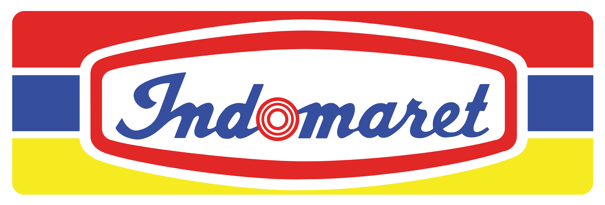

<H1> Convenience Store </H1>
One of the payment method offered by Midtrans is Convenience Store. By using this payment method, customers will have the option to make a payment via Convenience Store and Midtrans will send real time notification when the customer complete the payment.

At this moment, Midtrans has integrated with some Convenience Store:


<br>

   

Basic integration process of Convenience Store will be explained below.
<details>
<summary><b>Sequence Diagram Transaction Flow</b></summary>
<article>


</article>
</details>

#### Sandbox Environment
All the steps below are using [Midtrans Sandbox environment](https://account.midtrans.com/), not Production, to easily test the integration process. Make sure you are switching to Sandbox mode on your Midtrans account dashboard while retrieving Server Key and Client Key. Explained in [`Getting Started - Preparation`](/en/midtrans-account/overview.md).

Server Key and Client Key can be retrieved on menu `Settings` > `Access Key`.

?>**Info:**
[How to retrieved Access key](/en/midtrans-account/overview?id=retrieving-api-access-keys)

### Integration Step
1. Send transaction data to API Charge.
2. Show payment code to frontend.
3. Handle transaction notification.

Charge API request should be done from Merchant's backend. Server Key (from your account's Dashboard) will be needed to [authenticate the request](https://api-docs.midtrans.com/#http-s-header).

#### Request Details
Type | Value
--- | ---
HTTP Method | `POST`
API endpoint | `https://api.sandbox.midtrans.com/v2/charge`

#### HTTP Headers
```
Accept: application/json
Content-Type: application/json
Authorization: Basic AUTH_STRING
```

**AUTH_STRING**: Base64(`ServerKey + :`)

?> HTTP request by using Basic Authentication method. The username is your Server Key while the password is empty. The authorization header value is represented by AUTH_STRING. AUTH_STRING is base-64 encoded string of your username & password separated by **:** (colon symbol).


### 1. Send Transaction Data to API Charge

#### Charge API request
This is example of basic `/charge` API request in Curl, please implement according to your backend language (you can also check our available language libraries).
<!-- tabs:start -->
#### **Alfamart**

```bash
curl -X POST \
  https://api.sandbox.midtrans.com/v2/charge \
  -H 'Accept: application/json' \
  -H 'Authorization: Basic <YOUR SERVER KEY ENCODED in Base64>' \
  -H 'Content-Type: application/json' \
  -d '{
  "payment_type": "cstore",
  "transaction_details": {
      "order_id": "order-101",
      "gross_amount": 44000
  }
  "cstore" : {
    "store" : "alfamart",
    "message" : "Messeage ",
    "alfamart_free_text_1": "1st row of receipt,",
    "alfamart_free_text_2": "This is the 2nd row,",
    "alfamart_free_text_3": "3rd row. The end."
  }
}'
```
#### Alfamart Request Details
JSON Attribute         | Type       | Required  | Description
---------------------- | ---------- | --------  | -----------
store                  | String(20) | Y         | Store name                                       
message                | String(20) | N         | Label to be displayed in Alfamart POS
alfamart_free_text_1   | String(40) | N         | Customize the first row of description in Alfamart printed receipt
alfamart_free_text_2   | String(40) | N         | Customize the second row of description in Alfamart printed receipt
alfamart_free_text_2   | String(40) | N         | Customize the third row of description in Alfamart printed receipt


#### **Indomaret**
```bash
curl -X POST \
  https://api.sandbox.midtrans.com/v2/charge \
  -H 'Accept: application/json' \
  -H 'Authorization: Basic <YOUR SERVER KEY ENCODED in Base64>' \
  -H 'Content-Type: application/json' \
  -d '{
  "payment_type": "cstore",
  "transaction_details": {
      "order_id": "order-101",
      "gross_amount": 44000
  },
  "cstore" : {
    "store" : "indomaret",
    "message" : "Message to display"
  }
}'
```
#### Indomaret Request Details
JSON Attribute         | Type       | Required  | Description
---------------------- | ---------- | --------  | -----------
store                  | String(20) | Y        | Store name                                       
message                | String(20) | N         | Label to be displayed in Indomaret POS

<!-- tabs:end -->

?>**Optional:**
You can customize [transaction_details](https://api-docs.midtrans.com/#json-object) data. To include data like customer_details, item_details, etc. It's recommended to send as much detail so on report/dashboard those information will be included.

#### Charge API response
You will get the API response like the following.
<!-- tabs:start -->
#### **Alfamart**
```json
{
    "status_code": "201",
    "status_message": "Success, cstore transaction is successful",
    "transaction_id": "d615df87-c96f-4f5c-9d35-2d740d54c1a9",
    "order_id": "order-101o-1578557780",
    "merchant_id": "G812785002",
    "gross_amount": "162500.00",
    "currency": "IDR",
    "payment_type": "cstore",
    "transaction_time": "2020-01-09 15:16:19",
    "transaction_status": "pending",
    "fraud_status": "accept",
    "payment_code": "8127740588870520",
    "store": "alfamart"
}
```

#### **Indomaret**
```json
{
  "status_code": "201",
  "status_message": "Success, cstore transaction is successful",
  "transaction_id": "9b3951a4-da50-4089-86df-161d3e9251df",
  "order_id": "order-101n-1578557719",
  "gross_amount": "44000.00",
  "currency": "IDR",
  "payment_type": "cstore",
  "transaction_time": "2020-01-09 15:15:19",
  "transaction_status": "pending",
  "merchant_id": "G812785002",
  "payment_code": "578112341234",
  "store": "indomaret"
}
```
<!-- tabs:end -->
You will get the `payment_code` attribute which can be shown to your frontend.

### 2. Show payment code to frontend.
To show payment code to your frontend, use `payment_code` that retrieved from API response.

Then customer can be payment to convenience store using payment code that shown on merchant website / apps.

### 3. Handle transaction notification

HTTP notification from Midtrans to Merchant backend will also be triggered on event of `transaction_status` getting updated, to ensure merchant is securely informed. Including if transaction success or expired (not paid). So apart of JSON result above, Merchant backend will be notified by Midtrans.

HTTP POST request with JSON body will be sent to Merchant's **notification url** configured on dashboard (Settings > Configuration > Notification URL), this is the sample JSON body that will be received by Merchant:
<!-- tabs:start -->
#### **Alfamart**
```json
{
  "transaction_time": "2020-01-09 15:16:19",
  "transaction_status": "settlement",
  "transaction_id": "d615df87-c96f-4f5c-9d35-2d740d54c1a9",
  "store": "alfamart",
  "status_message": "midtrans payment notification",
  "status_code": "200",
  "signature_key": "6fd1210e6e4b60d7cc3862780016b110f9d3d56e291172c69b0bbfd60d380be22ad02f1d48bbabeeb81a882d7abbd3d6fa94207bede9132adc1a773489dfd0c8",
  "settlement_time": "2020-01-09 15:20:09",
  "payment_type": "cstore",
  "payment_code": "8127740588870520",
  "order_id": "order-101o-1578557780",
  "merchant_id": "G812785002",
  "gross_amount": "162500.00",
  "fraud_status": "accept",
  "currency": "IDR"
}
```

#### **Indomaret**
```json
{
  "transaction_time": "2020-01-09 15:15:19",
  "transaction_status": "settlement",
  "transaction_id": "9b3951a4-da50-4089-86df-161d3e9251df",
  "store": "indomaret",
  "status_message": "midtrans payment notification",
  "status_code": "200",
  "signature_key": "82faa4ab71128bf8f1b13359003688409e5656bae0bb2f39669f7685e3af26ce6f676384fd05cca9349d155ab8b08789761cb399e5530bf2e68d414b8856be0d",
  "settlement_time": "2020-01-09 15:22:07",
  "payment_type": "cstore",
  "payment_code": "578112341234",
  "order_id": "order-101n-1578557719",
  "merchant_id": "G812785002",
  "gross_amount": "44000.00",
  "currency": "IDR",
  "approval_code": "45682001084123432248"
}
```
<!-- tabs:end -->

### Switching To Production
To use Midtrans production environment (accept real payment from real customer), please make sure to:

1. Switch the API domain URL from `api.sandbox.midtrans.com` to `api.midtrans.com`
2. Switch the Client Key and Server Key from sandbox Dashboard, with keys from production Dashboard.


## Next Step:
<br>

<div class="my-card">

#### [Taking Action of Payment &#187;](/en/)
</div>

<div class="my-card">

#### [Transaction Status Cycle and Action &#187;](/en/)
</div>

<hr>
