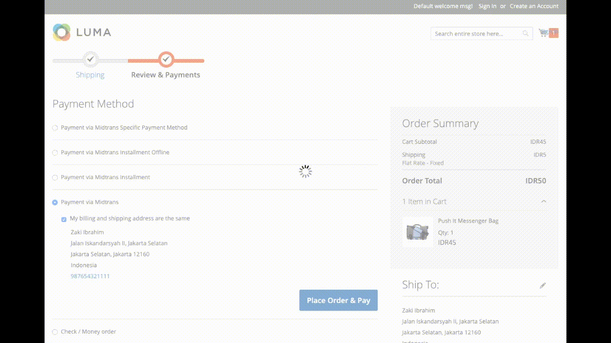
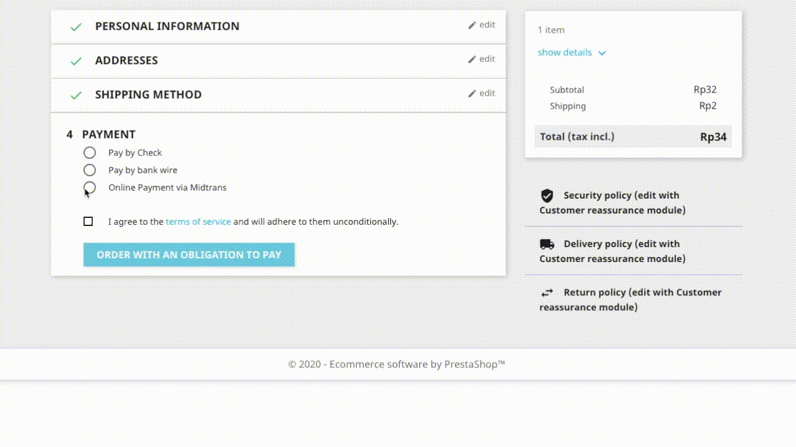
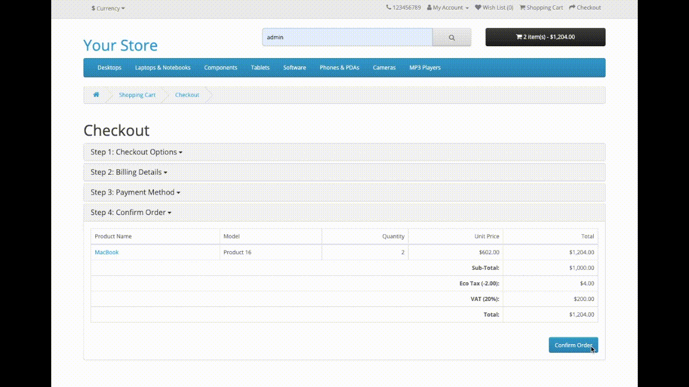
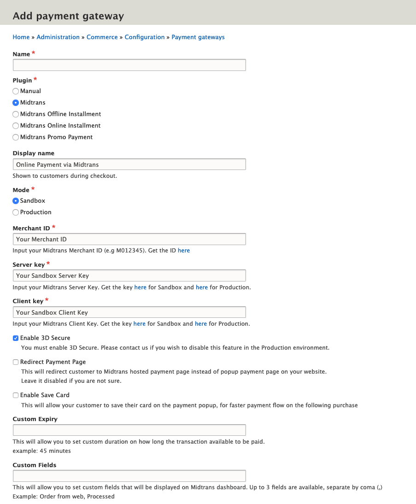
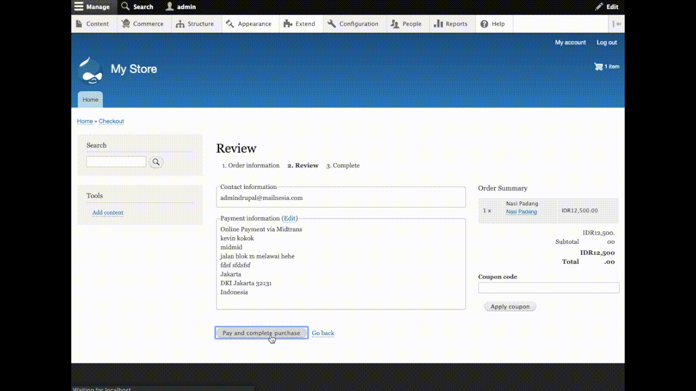
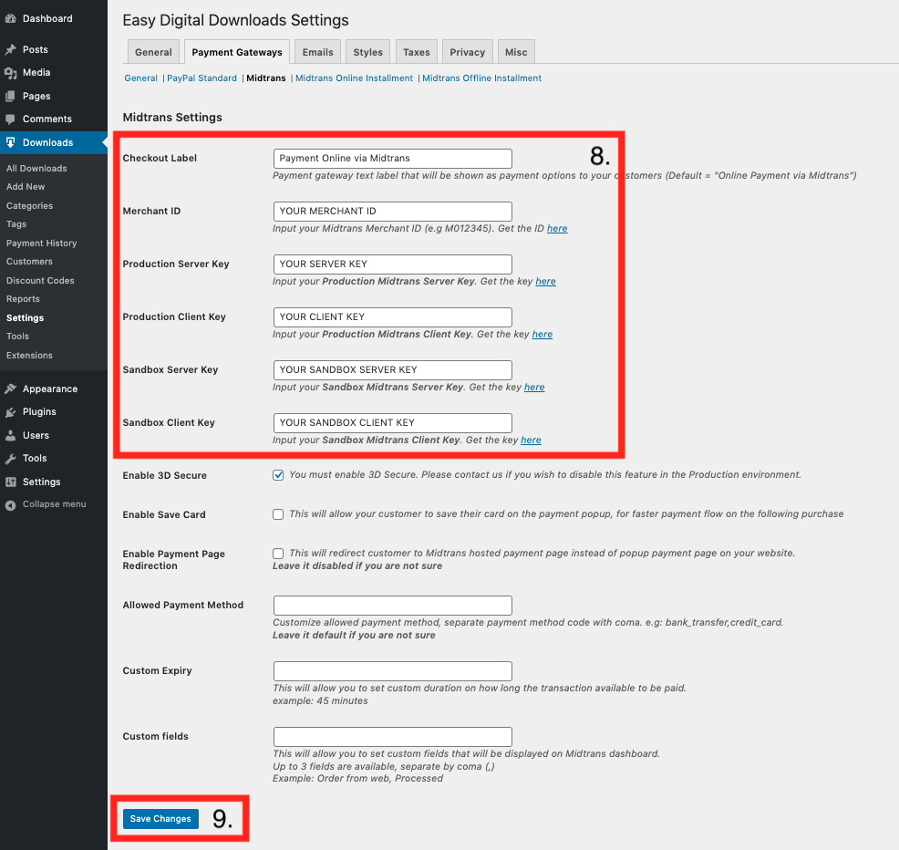

# Integrate Midtrans Snap to Ecommerce Content Management System

Content Management System (CMS) allow you to easily have website / web store without building (programming) from scratch. Most of the time CMS don't require you to know too much about technical knowledge, by just installing the CMS and then configure or customize it to suit your desire. It means most of the time you just need to care about managing the content (Content Management). Example of CMS are: Wordpress, Magento 2, Prestashop, WHMCS, etc.

### Preparation
 

#### [Sign Up for Midtrans Account](/en/midtrans-account/overview.md)
Sign up for an Account to get your Sandbox API keys ready to test integration.

#### [Retrieve API Keys](/en/midtrans-account/overview.md#retrieving-api-access-keys)
Retrieve Sandbox mode API keys that will be used for this guide.

?>**Note:**
Make sure to follow [preparation section](#preparation) to retrieve Client Key & Server Key, before proceeding.

Here is the list of Content Management System plugins and extensions that are supported by Midtrans. Step by step guide to install Snap integration plugin to your CMS of choice, will be explained below.
#### Choose from any CMS of your choice:
 

<!-- NOTE: "Space" is intentionally added as prefix, to avoid header ID conflict-->
#### [ Wordpress - Woocommerce](#wordpress-woocommerce)

#### [ Magento](#magento)

#### [ Prestashop](#prestashop)

#### [ Opencart](#opencart)

#### [ WHMCS](#whmcs)

#### [ Drupal](#drupal-8)

#### [ Wordpress - Easy Digital Download](#wordpress-easy-digital-download)

<!-- TODO: explain what is notifcation URL for non dev user. Why it is important, and what's the benefit of using notification url -->

  

### Wordpress - WooCommerce

Midtrans  ❤️ WooCommerce! This plugin will allow secure online payment on your WooCommerce store, without your customer ever need to leave your WooCommerce store! With beautiful responsive payment interface built-in. We strive to make payments simple for both the merchant and customers. Support various online payment channel. Support WooCommerce v3 & v2.

Our WooCommerce plugins also available on [Wordpress plugins store](https://wordpress.org/plugins/midtrans-woocommerce/). If it's not listed there, you can always download and [install as described below](#b-manual-installation).

#### Requirements:
* WordPress v3.9 or greater **|** Tested up to v5.x
* WooCommerce v2 or greater **|** Tested up to v3.5.2
* PHP version v5.4 or greater
* MySQL version v5.0 or greater
* PHP CURL enabled server/host

#### Installation:

Choose **one** from installation options **A or B**:

#### A. Simple Installation
   1. Login to your Wordpress admin panel.
   2. Go to Plugins menu, click add new. Search for Midtrans-WooCommerce plugin.
   3. Install and follow on screen instructions.
   4. Proceed to Configuration Process.

If you are unable to install using this method, please proceed with [manual installation below](#b-manual-installation).

#### B. Manual Installation
   1. Download the plugin from [Zip](https://github.com/veritrans/SNAP-Woocommerce/archive/master.zip).
   2. Extract the plugin, then rename the modules folder as **midtrans-woocommerce**.
   3. Upload the unzipped plugin folder to your WordPress installation's `./wp-content/plugins/` directory.
   4. Install and activate the plugin from plugins menu within the WordPress admin panel
   5. Proceed to Configuration Process.
   
#### WooCommerce Plugin Configuration Process
1. Go to **WooCommerce -> Settings -> Payments -> Midtrans** menu, fill the configuration fields.
    - Fill **Title** with text button that you want to display to customer
    - Select **Environment**. `Sandbox` for testing transaction and `Production` for real transaction
    - Fill **Merchant ID, Client Key, and Server key**. You can find [this credential on Midtrans MAP Dashboard](/en/snap/preparation.md).
    - Other configuration are optional, you may leave it as is.

#### WooCommerce Plugin Notification Configuration
Login to your [Midtrans Account](https://account.midtrans.com/login), select your environment (sandbox/production), go to menu `settings` **->** `configuration` and `settings` **->** `Snap Preference` **->** `System Settings`

| URL Role | Redirect URL|
|----------|-------------|
| Payment Notification URL | [your-site-url]/?wc-api=WC_Gateway_Midtrans |
| Finish Redirect URL | [your-site-url]/?wc-api=WC_Gateway_Midtrans |
| Error Redirect URL | [your-site-url]/?wc-api=WC_Gateway_Midtrans |
| Unfinish Redirect URL | [your-site-url]/?wc-api=WC_Gateway_Midtrans |

> **Note:**
>
> The `your-site-url` is where you install your Wordpress, it can be the domain root directory (e.g: `https://myshop.com` or `https://shop.myshop.com`) or within a sub directory (e.g: `https://myshop.com/wordpress/`)
>
> Please make sure to input **http://** or **https://** when filling Notification URL and Redirect URL, according to your web-server configuration. 
> 
> If you are not sure, try opening your web URL in a browser, and check the URL is **http** or **https** on the address bar.

  
#### Transaction Test

<article>

1. Perform successful transaction in your online store by inputing a dummy credit card number below (Sandbox Mode, [other test credentials](/en/technical-reference/sandbox-test.md)):
  * **Card Number**: 4811 1111 1111 1114
  * **CVV**: 123
  * **Exp. Month**: 01
  * **Exp. Year**: 2025

2. Examine a few points below to ensure plugin is installed and performs properly.

Check Point| Expected Result |When Unexpected Result Occurs
--- | --- | ---
Check order status in CMS back end|  Order status recorded in backend| Check endpoint/payment notification URL setting in MAP.  Check if your CMS/notification url can be accessed from public internet properly
Merchant receives email notification|  Receive notification|  Check MAP menu setting - email notification
Customer receives email notification| Receive notification|  Check MAP menu setting - email notification

#### Payment Example

</article>

For more detailed and further configurations, you can also visit this [specific Midtrans Woocommerce wiki documentation](https://github.com/veritrans/SNAP-Woocommerce/wiki).

  

### Magento

Midtrans ❤️ Magento! Midtrans highly concerned with customer experience (UX). We strive to make payments simple for both the merchant and customers. With this plugin you can make your Magento store using Midtrans payment. This extension also available on [Magento Marketplace](https://marketplace.magento.com/midtrans-snap.html).

> This is for Magento 2, for Magento 1 please refer to this [list of plugins](/en/technical-reference/library-plugin.md#snap-plugin-for-e-commerce-cms)

#### Requirements:
* An online store with Magento infrastructure. This plugin is tested with **Magento v2.3.4**
* PHP v5.6 or greater.
* MySQL v5.7 or greater.
* Midtrans plugin for Magento For Magento v2.x [ [Github](https://github.com/Midtrans/Midtrans-Magento2) | [Zip](https://github.com/Midtrans/Midtrans-Magento2/archive/master.zip) ] , For Magento v1.9 [ [Github](https://github.com/veritrans/SNAP-Magento) | [Zip](https://github.com/veritrans/SNAP-Magento/archive/master.zip) ] 
*   This plugin supports Magento2 version 2.1.0, 2.2.0, 2.3.4 and higher.

#### Installation:
#### Install Midtrans Snap plugins through Magento marketplace 
You can install Midtrans Snap plugins through Magento Marketplace. Please, visit Midtrans on [Magento Marketplace](https://marketplace.magento.com/midtrans-snap.html) and follow step-by-step installation instructions from the [Official Magento extension docs](https://docs.magento.com/user-guide/system/web-setup-extension-manager.html)

#### Install Midtrans Snap plugins through Composer
Before you begin to install through the composer, you need Magento marketplace account and make sure that you have installed Composer. In your terminal, go to the Magento folder and run the following commands:
1. Install the plugins: `composer require midtrans/snap`
2. Enable the plugin:  `bin/magento module:enable Midtrans_Snap`
3. Execute upgrade script : `bin/magento setup:upgrade`
4. Flush cache storage :  `bin/magento cache:flush`
5. Login to your Magento Admin Panel.
6. Proceed to [Plugins Configurations](#magento-2-plugin-configuration) section.
#### Install Midtrans Snap plugins from GitHub project
With these steps, you can custom/modify our Magento plugins to handle the business model that you want

1. Download and extract the plugin you have previously downloaded from GitHub and rename the folder as Snap.
2. Make a directory structure like this: 

3. Locate the root Magento directory of your shop via FTP connection.
4. Copy the app folders into the Magento root folder.
5. Run this command on terminal

    `bin/magento module:enable Midtrans_Snap`
    
    `bin/magento setup:upgrade`
    
    `bin/magento cache:flush`

6. Login to your Magento Admin Panel.
7. Proceed to [Plugins Configurations](#magento-2-plugin-configuration) section.

#### Magento 2 Plugin Configuration
Before you begin, make sure that you have successfully installed and enabled Midtrans Snap plugins.
Configure the Midtrans plugin in your Magento admin panel: 
1. Login to your Magento Admin Panel.
2. In the left navigation bar, go to **Stores(1)** -> **Configuration(2)**. 
3. In the menu, go to **Sales(3)** -> **Payment Methods(4)**

4. In the **Midtrans - Accept Online Payment** section, click **Basic Settings** and fill out the following fields:

| Field                   | Description									                               |
|-------------------------| ---------------------------------------------------------------------------|
| Is Production           | Select whether you want to use a sandbox or production mode\.			|
| Merchant ID             | Unique id of your Midtrans account for which the payments will be processed\.|
| Sandbox \- ClientKey    | Used as an API key to be used for authorization sandbox environment on frontend API request/configuration\. So it is safe to put in your HTML / client code publicly\.    |
| Sandbox \- ServerKey    | Used as an API key to be used for authorization sandbox environment while calling Midtrans API from the backend\. So keep it stored confidentially\.                      |
| Production \- ClientKey | Used as an API key to be used for authorization production environment on frontend API request/configuration\. So it is safe to put in your HTML / client code publicly\. |
| Production \- ServerKey | Used as an API key to be used for authorization production environments while calling Midtrans API from the backend\. So keep it stored confidentially                    |
| Enable Snap redirect    | Change to Snap redirect mode, the default value is No\.			 |

>Note: Access Keys are unique for every merchant. Server Key is secret, please always keep Server Key confidential.

#### Log options

The plugins will store log file in directory `/var/log/midtrans`. The default value is on for request, notification and error log. Except Throw Exception, is off by default.

#### Config Plugins Payment Integration

In the Midtrans Magento plugins we have 4 option to use Snap model payment method, with the following description:

1. **Snap payment integration**
    
    This is the default Snap for Midtrans Magento plugins, Snap payment will be auto-enabled when installing the Midtrans plugins. Midtrans will show the available payment method on the Snap payment screen.

2. **Specific Payment integration | Optional** 
    
    Enabling this will display additional payment options to customer, for specific payment that are specified in the "Allowed Payment Method" field, Midtrans Snap will show only the listed payment method on the Snap screen.

3. **Online Installment payment integration | Optional**

    Enabling this will display additional payment options to customer, for online installment payment where the Card Issuer and Acquiring Bank is the same entity (e.g: BNI Card and BNI Acquiring bank).

4. **Offline Installment payment integration | Optional**

    Enabling this will display additional payment options to customer, for offline Installment where the Card Issuer and Acquiring Bank don't have to be same entity (e.g: BNI Card and Mandiri Acquiring Bank)

>Note: You can use different Midtrans Account for every Snap model payment method, should configure the access-key in Optional section `“Use different Midtrans account”`. If the optional access-key is empty, the plugins will automatically use access key on Basic Settings.

>INFO: The built-in BCA Klikpay landing page for now will only use server key from basic settings of Snap payment integration

#### Customize configuration

In case you need to customize configuration these field are configurable, and described as follows:
<article>

| Field                  | Description            
|------------------------|---------------------------------------------------------------------------|
| Enable                 | Payment snap section enable                                                                        
| Title                  | The title for the payment method in the checkout page
| Custom Expiry          | This field will allow you to set a custom duration on how long the transaction is available to be paid\.                                                                                                        
| Allowed Payment Method | Customize allowed payment method, separate payment method code with a comma\. e\.g: bank\_transfer,credit\_card\. Leave it default if you are not sure\.                                                        
| Acquiring Bank         | You can specify which Acquiring Bank they prefer to use for a specific transaction\. The transaction fund will be routed to that specific acquiring bank\. Leave it blank if you are not sure\!                 
| BIN Number             | It is a feature that allows the merchant to accept only Credit Cards within a specific set of BIN numbers\. Separate BIN number with comma Example: 4,5,4811,bni,mandiri\. Leave it blank if you are not sure\! |
| Installment Terms      | An arrangement for payment by installments\.                             
| 3D Secure              | You must enable 3D Secure for secure card transactions\. Please contact us if you wish to disable this feature in the Production environment\.                                                                  
| Save Card              | This will allow your customer to save their card on the payment popup, for faster payment flow on the following purchase\.  

</article>

#### Magento 2 Plugin Notification Configuration
1. Login to your [Midtrans&nbsp;  Account](https://dashboard.midtrans.com), select your environment (sandbox/production), go to menu `settings -> configuration`

| URL Role | Redirect URL|
|----------|-------------|
| Payment Notification URL | [your-site-url]/snap/payment/notification |
| Finish Redirect URL | [your-site-url]/snap/index/finish |
| Error Redirect URL | [your-site-url]/snap/index/finish |
| Unfinish Redirect URL | [your-site-url]/snap/index/finish |

> **Note:**
>
> Please make sure to input **http://** or **https://** when filling Notification URL and Redirect URL, according to your web-server configuration. 
> 
> If you are not sure, try opening your web URL in a browser, and check the URL is **http** or **https** on the address bar.

2. Go to menu **Settings > Snap Preference > System Settings**
    * Insert `[your-site-url]/snap/index/finish` link as Finish/Unfinish/Error Redirect URL.

  
#### How to online refund transaction

You can request refunds either from the [Midtrans Dashboard](https://dashboard.midtrans.com/transactions) or from the Magento admin. After a refund is issued, it cannot be cancelled or undone. Before you trigger this request, make sure that the refund amount and any other details are correct. The online refund feature is available for payment method gopay and credit card.

If you make refund from the Midtrans Dashboard, Refund notification is sent to Magento, set transaction state to CLOSED and for now is not created the credit memo.
<article>

#### Request refund from Magento Admin:

1. Log in to your Magento admin panel. 
2. In the menu, go to **Sales** > **Orders**. This opens the order overview page. 
3. Click on the **order** you want to refund.
4. In the **Order list View** left-hand navigation sidebar, click **Invoices** tab.
5. In the **invoice list page**, selected the **order**. click the **view button** on invoice you need to request online refund.
6. Click **Credit Memo** on the top-right corner of the page.
7. In the **New Memo for Invoice** page, scroll down to the **Refund Totals** section.
8. In this section, you can request online **Refund** or **Refund Offline**.
    *   **Refund:** This option will request refund Online to Midtrans, Midtrans automatically send refund notification and changes order status to **Closed** from notification.
    *   **Refund Offline**: An offline refund does not trigger request refund to midtrans it’s only refund in Magento side. You need to take action and carry out the refund manually from Midtrans dashboard.After a refund operation, the order status changes to **Closed**. This order status change is controlled by the Magento system. 
    
    The status change may not mean that the refund has carried out successfully on Midtrans side. When the transaction status in Midtrans dashboard changes to REFUND, then the refund went through successfully
    
</article>

#### Transaction Test

<article>

1. Perform successful transaction in your online store by inputing a dummy credit card number below (Sandbox Mode, [other test credentials](/en/technical-reference/sandbox-test.md)):
  * **Card Number**: 4811 1111 1111 1114
  * **CVV**: 123
  * **Exp. Month**: 01
  * **Exp. Year**: 2025

2. Examine a few points below to ensure plugin is installed and performs properly.

Check Point| Expected Result |When Unexpected Result Occurs
--- | --- | ---
Check order status in CMS back end|  Order status recorded in backend| Check endpoint/payment notification URL setting in MAP.  Check if your CMS/notification url can be accessed from public internet properly
Merchant receives email notification|  Receive notification|  Check MAP menu setting - email notification
Customer receives email notification| Receive notification|  Check MAP menu setting - email notification

#### Payment Example

</article>

  

### Prestashop

Midtrans ❤️ Prestashop! Integrate your Prestashop store with Midtrans Snap payment gateway. We strive to make payments simple for both the merchant and customers. This plugin will allow online payment on your Prestashop store using various online payment channel.

#### Requirements:
* Prestashop 1.6 & 1.7 or greater
* PHP version 5.4 or greater
* MySQL version 5.0 or greater
* Midtrans plugin for PrestaShop [ [Github](https://github.com/veritrans/SNAP-Prestashop) | [Zip](https://github.com/veritrans/SNAP-Prestashop/archive/master.zip) ].

#### Installation Process:

1. Extract the plugin you have previously downloaded and rename folder as **midtranspay**. Then Zip the folder back into **midtranspay.zip**.
2. Go to your Prestashop administration page and go to **Modules - Modules Manager** menu.
3. Click on the **Upload a module** and locate the **midtranspay.zip** file, then upload it.
4. Find the **Midtrans Pay** module in the module manager and click configure.
    * Fill Payment Option Display Text with text button that you want to display to Customer.
    * Select **Environment**, Development for testing transaction, Production for real transaction.
    * Fill in the **Merchant ID,** **Client key & Server key**. You can find this credential on Midtrans MAP `Dashboard Settings` **->** `Access Keys`.
    * **Map payment SUCCESS status to:** select your desired order status when payment is success.
    * **Map payment FAILURE status to:** select your desired order status when payment is failure.
    * **Map payment PENDING/CHALLENGE status to:** select your desired order status when payment is challenged.
    * Other configuration are optional, you may leave it as is.

#### Prestashop Plugin Notification Configuration
Login to your [Midtrans Account](https://account.midtrans.com/login), select your environment (sandbox/production), go to menu `settings > configuration`

| URL Role | Redirect URL|
|----------|-------------|
| Payment Notification URL | [your-site-url]/index.php?fc=module&module=midtranspay&controller=notification |
| Finish Redirect URL | [your-site-url]/index.php?fc=module&module=midtranspay&controller=success |
| Error Redirect URL | [your-site-url]/index.php?fc=module&module=midtranspay&controller=failure |
| Unfinish Redirect URL | [your-site-url]/index.php?fc=module&module=midtranspay&controller=success |

> **Note:**
>
> Please make sure to input **http://** or **https://** when filling Notification URL and Redirect URL, according to your web-server configuration. 
> 
> If you are not sure, try opening your web URL in a browser, and check the URL is **http** or **https** on the address bar.

  
#### Transaction Test

<article>

1. Perform successful transaction in your online store by inputing a dummy credit card number below (Sandbox Mode, [other test credentials](/en/technical-reference/sandbox-test.md)):
  * **Card Number**: 4811 1111 1111 1114
  * **CVV**: 123
  * **Exp. Month**: 01
  * **Exp. Year**: 2025

2. Examine a few points below to ensure plugin is installed and performs properly.

Check Point| Expected Result |When Unexpected Result Occurs
--- | --- | ---
Check order status in CMS back end|  Order status recorded in backend| Check endpoint/payment notification URL setting in MAP.  Check if your CMS/notification url can be accessed from public internet properly
Merchant receives email notification|  Receive notification|  Check MAP menu setting - email notification
Customer receives email notification| Receive notification|  Check MAP menu setting - email notification

#### Payment Example

</article>

  

### Opencart

Midtrans ❤️ Opencart! This is official Midtrans extension for the OpenCart E-Commerece platform.

#### Requirements:

* Opencart minimal 2.0 or greater
* PHP version 5.4 or greater
* MySQL version 5.0 or greater
* Midtrans plugin for Opencart

#### Installation:
1. Download midtrans opencart plugins and extract the zip file
    * [Opencart v3.0](https://github.com/Midtrans/Midtrans-Opencart3)
    * [Opencart v2.3](https://github.com/Midtrans/SNAP-Opencart-2.3/)
    * [Opencart v2.0, v2.1, v2.2](https://github.com/veritrans/SNAP-Opencart)
2. Locate the root OpenCart directory of your shop via FTP connection.
3. Copy the `admin`, `catalog`, and `system` folders into your OpenCart root folder, and merge it.
4. In your OpenCart admin area, go to **Extensions** -> **Extensions**.
5. Filter by Payments, scroll down until you find Midtrans.
6. Click the green install button and click the edit button on the plugin.
7. Configure your merchant details:
   - Fill **Display name** with text button that you want to display to customer.
   - Fill **Merchant Id** with your Merchant Id [Midtrans account](https://dashboard.midtrans.com/settings/config_info/).
   - Select **Environment**, `Sandbox` is for testing transaction, `Production` is for real transaction.
   - Fill in the **client key** & **server key** with your corresonding [Midtrans account](https://dashboard.midtrans.com/settings/config_info/).
   - Note: key for Sandbox & Production is different, make sure you use the correct one.
   - **SUCCESS Order Status** select your desired order status when payment is success (recommended: `Processing`).
   - **PENDING Order Status** select your desired order status when payment is failure (recommended: `Pending`).
   - **FAILURE Order Status** select your desired order status when payment is pending (recommended: `Canceled`).
   - Other configuration are optional, you can leave it as default.

#### Opencart Plugin Notification Configuration
Login to your [Midtrans Account](https://account.midtrans.com/login), select your environment (sandbox/production), go to menu `settings` **->** `configuration`

| URL Role | Redirect URL|
|----------|-------------|
| Payment Notification URL | [your-site-url]/index.php?route=payment/snap/payment_notification |
| Finish Redirect URL | [your-site-url]/index.php?route=payment/snap/landing_redir& |
| Error Redirect URL | [your-site-url]/index.php?route=payment/snap/landing_redir& |
| Unfinish Redirect URL | [your-site-url]/index.php?route=payment/snap/landing_redir& |

> **Note:**
>
> Please make sure to input **http://** or **https://** when filling Notification URL and Redirect URL, according to your web-server configuration. 
> 
> If you are not sure, try opening your web URL in a browser, and check the URL is **http** or **https** on the address bar.

  
#### Transaction Test

<article>

1. Perform successful transaction in your online store by inputing a dummy credit card number below (Sandbox Mode, [other test credentials](/en/technical-reference/sandbox-test.md)):
  * **Card Number**: 4811 1111 1111 1114
  * **CVV**: 123
  * **Exp. Month**: 01
  * **Exp. Year**: 2025

2. Examine a few points below to ensure plugin is installed and performs properly.

Check Point| Expected Result |When Unexpected Result Occurs
--- | --- | ---
Check order status in CMS back end|  Order status recorded in backend| Check endpoint/payment notification URL setting in MAP.  Check if your CMS/notification url can be accessed from public internet properly
Merchant receives email notification|  Receive notification|  Check MAP menu setting - email notification
Customer receives email notification| Receive notification|  Check MAP menu setting - email notification

#### Payment Example

</article>

  

### WHMCS

#### Requirements:
   * WHMCS v5.3.12 - v7.x or greater (Tested up to WHMCS v7.6 - running well)
   * PHP version 5.4 or greater
   * MySQL version 5.0 or greater
   * Midtrans plugin for WHMCS [ [Github](https://github.com/veritrans/SNAP-whmcs) | [Zip](https://github.com/veritrans/SNAP-whmcs/archive/master.zip) ].

#### Installation:
   1. Download the modules from the link above.
   2. Extract **Whmcs-master.zip** file you have previously downloaded.
   3. Upload & merged module folder that you have extracted into your WHMCS directory. **Installation & Configuration**
   4. Access your WHMCS admin page.
   5. Go to `Setup` **->** `Payments` **->** `Payment Gateways` menu.
   6. Click **Midtrans** payment method, then you will be redirected to configuration page.
   7. Fill the input as instructed on the screen. Click **Save Changes**.

#### WHMCS Plugin Notification Configuration
Login to your [Midtrans Account](https://account.midtrans.com/login), select your environment (sandbox/production), go to menu `settings` **->** `configuration` and `settings` **->** `Snap Preference` **->** `System Settings`

| URL Role | Redirect URL|
|----------|-------------|
| Payment Notification URL | [your-site-url]/modules/gateways/callback/veritrans.php |
| Finish Redirect URL | [your-site-url] |
| Error Redirect URL | [your-site-url] |
| Unfinish Redirect URL | [your-site-url] |

> **Note:**
>
> Please make sure to input **http://** or **https://** when filling Notification URL and Redirect URL, according to your web-server configuration. 
> 
> If you are not sure, try opening your web URL in a browser, and check the URL is **http** or **https** on the address bar.

  
#### Transaction Test

<article>

1. Perform successful transaction in your online store by inputing a dummy credit card number below (Sandbox Mode, [other test credentials](/en/technical-reference/sandbox-test.md)):
  * **Card Number**: 4811 1111 1111 1114
  * **CVV**: 123
  * **Exp. Month**: 01
  * **Exp. Year**: 2025

2. Examine a few points below to ensure plugin is installed and performs properly.

Check Point| Expected Result |When Unexpected Result Occurs
--- | --- | ---
Check order status in CMS back end|  Order status recorded in backend| Check endpoint/payment notification URL setting in MAP.  Check if your CMS/notification url can be accessed from public internet properly
Merchant receives email notification|  Receive notification|  Check MAP menu setting - email notification
Customer receives email notification| Receive notification|  Check MAP menu setting - email notification

</article>

  

### Drupal 8

Midtrans ❤️ Drupal 8! This is the official Midtrans extension for the Drupal E-commerce platform. Easily integrate your Drupal Commerce store with Midtrans payment gateway.

#### Requirements :
   * PHP v5.6.x or greater
   * MySQL version 5.0 or greater
   * Drupal v8.x
   * Drupal Commerce 8.x-2.xx

#### Installation :
1. Download the plugin file and unzip it, rename folder to **commerce_midtrans**.
2. Using an FTP client, or your hosting control panel, upload the unzipped plugin folder to your Drupal modules installation's **[Drupal folder]/modules/contrib/** directory.
3. Open drupal admin page, open menu **Extend**.
4. Look for **Commerce Midtrans** modules under **COMMERCE (CONTRIB)** group, enable by ticking the checkboxes.

5. Scroll down and click **Install**.
6. Go to `Commerce` **->** `Configuration` **->** `Payment` **->** `Payment gateways`.

7. Click **Add payment gateway** button.

8. Click **Midtrans** under Actions.
9. Fill the following config fields as instructed on each settings description.
    * Fill **Display Name** with text button that you want to display to customer.
    * Select **Mode**, Sandbox for testing transaction and Production for real transaction.
    * Fill **Merchant ID, Client Key and Server key**. You can find this credential on Midtrans MAP Dashboard.
    * Other configuration are optional, you may leave it as is.

10. Click save.

#### Drupal Handling Notification
Login to your [Midtrans Account](https://account.midtrans.com/login), select your environment (sandbox/production), go to menu `settings` **->** `configuration` and `settings` **->** `Snap Preference` **->** `System Settings`

| URL Role | Redirect URL|
|----------|-------------|
| Payment Notification URL | [your-site-url]/payment/notify/midtrans |
| Finish Redirect URL | [your-site-url] |
| Error Redirect URL | [your-site-url] |
| Unfinish Redirect URL | [your-site-url] |

> **Note:**
>
> Please make sure to input **http://** or **https://** when filling Notification URL and Redirect URL, according to your web-server configuration. 
> 
> If you are not sure, try opening your web URL in a browser, and check the URL is **http** or **https** on the address bar.

  
#### Transaction Test

<article>

1. Perform successful transaction in your online store by inputing a dummy credit card number below (Sandbox Mode, [other test credentials](/en/technical-reference/sandbox-test.md)):
  * **Card Number**: 4811 1111 1111 1114
  * **CVV**: 123
  * **Exp. Month**: 01
  * **Exp. Year**: 2025

2. Examine a few points below to ensure plugin is installed and performs properly.

Check Point| Expected Result |When Unexpected Result Occurs
--- | --- | ---
Check order status in CMS back end|  Order status recorded in backend| Check endpoint/payment notification URL setting in MAP.  Check if your CMS/notification url can be accessed from public internet properly
Merchant receives email notification|  Receive notification|  Check MAP menu setting - email notification
Customer receives email notification| Receive notification|  Check MAP menu setting - email notification

#### Payment Example

</article>

  

### Wordpress - Easy Digital Download

Midtrans ❤️ EDD! Integrate your Easy Digital Download store with Midtrans Snap payment gateway. We strive to make payments simple for both the merchant and customers. This plugin will allow online payment on your EDD store using various online payment channel. 

Our EDD plugins also available on [Wordpress plugins store](https://wordpress.org/plugins/edd-midtrans-gateway/) 

#### Requirements:
   * WordPress 3.9.1 or greater
   * Easy Digital Downloads 2.0 or greater
   * PHP version 5.4 or greater
   * MySQL version 5.0 or greater
   * PHP CURL enabled server/host

#### Installation:

Choose **one** from installation options **A or B**:

#### A. Simple Installation:

1. Login to your Wordpress admin panel.
2. Go to Plugins menu, click add new. Search for **Midtrans-Easy-Digital-Downloads** plugin.
3. Install and follow on screen instructions.
4. Proceed to configuration section.

#### B. Manual Installation:

The manual installation method involves downloading our feature-rich plugin and uploading it to your webserver via your favorite FTP application.

1. Download the plugin file to your computer and unzip it
2. Extract the plugin, then rename the folder modules as **edd-midtrans-gateway**
3. Using an FTP program, or your hosting control panel, upload the unzipped plugin folder to your WordPress installation wp-content/plugins/ directory.
4. Install & Activate the plugin from the Plugins menu within the WordPress admin panel.
5. Activate Easy Digital Downloads - Midtrans Gateway plugin from Plugin menu in your WordPress admin page.

#### Easy Digital Download Plugin Configuration
<!-- TODO: add step by step text guide -->

#### Easy Digital Download Notification Configuration
Login to your [Midtrans Account](https://account.midtrans.com/login), select your environment (sandbox/production), go to menu `settings` **->** `configuration` and `settings` **->** `Snap Preference` **->** `System Settings`

| URL Role | Redirect URL|
|----------|-------------|
| Payment Notification URL | [your-site-url]/?edd-listener=midtrans |
| Finish Redirect URL | [your-site-url] |
| Error Redirect URL | [your-site-url] |
| Unfinish Redirect URL | [your-site-url] |

> **Note:**
>
> Please make sure to input **http://** or **https://** when filling Notification URL and Redirect URL, according to your web-server configuration. 
> 
> If you are not sure, try opening your web URL in a browser, and check the URL is **http** or **https** on the address bar.

  
#### Transaction Test

<article>

1. Perform successful transaction in your online store by inputing a dummy credit card number below (Sandbox Mode, [other test credentials](/en/technical-reference/sandbox-test.md)):
  * **Card Number**: 4811 1111 1111 1114
  * **CVV**: 123
  * **Exp. Month**: 01
  * **Exp. Year**: 2025

2. Examine a few points below to ensure plugin is installed and performs properly.

Check Point| Expected Result |When Unexpected Result Occurs
--- | --- | ---
Check order status in CMS back end|  Order status recorded in backend| Check endpoint/payment notification URL setting in MAP.  Check if your CMS/notification url can be accessed from public internet properly
Merchant receives email notification|  Receive notification|  Check MAP menu setting - email notification
Customer receives email notification| Receive notification|  Check MAP menu setting - email notification

#### Payment Example

</article>

