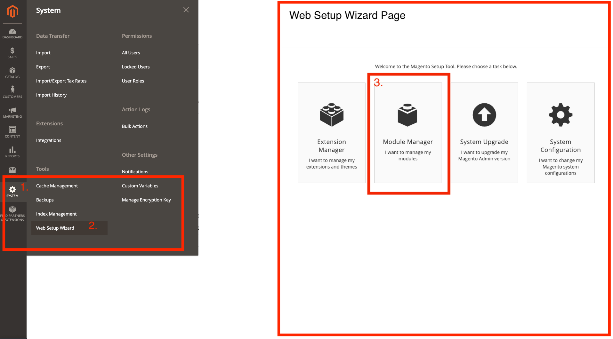
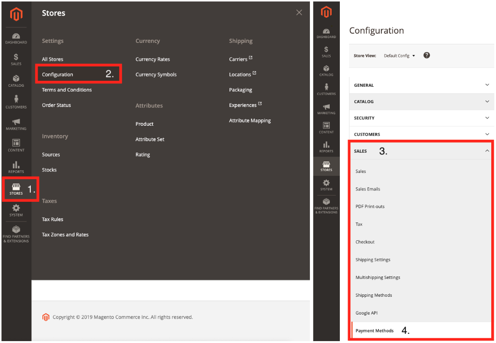
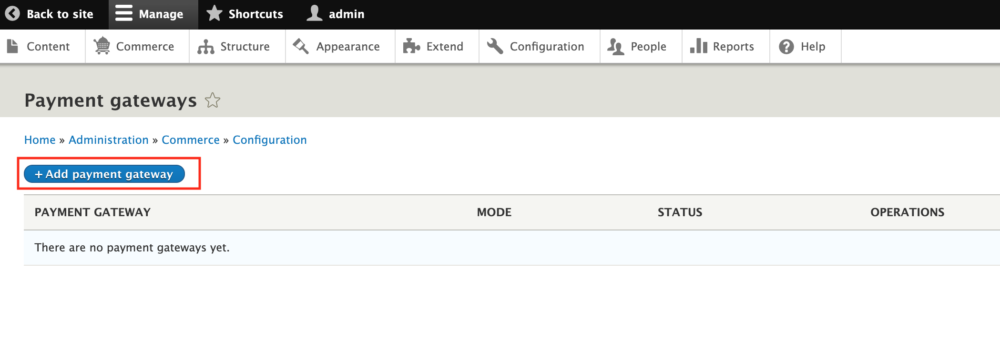
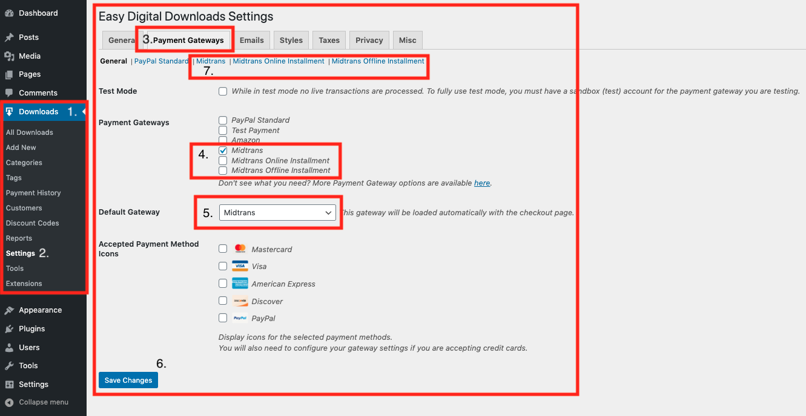

## Available CMS plugin/module

Content Management System (CMS) allow you to easily have website / web store without building (programming) from scratch. Most of the time CMS don't require you to know too much about technical knowledge, by just installing the CMS and then configure or customize it to suit your desire. It means most of the time you just need to care about managing the content (Content Management). Example of CMS are: Wordpress, Magento 2, Prestashop, WHMCS, etc.

?>**Note:**
Make sure to follow [preparation section to retrieve Client Key & Server Key](/en/midtrans-account/overview.md#retrieving-api-access-keys), before proceeding.

Step by step guide to install Snap integration plugin to your CMS of choice, will be explained below.
#### Choose from any CMS of your choice:
 

<!-- NOTE: "Space" is intentionally added as prefix, to avoid header ID conflict-->
#### [ Wordpress - Woocommerce](#wordpress-woocommerce)

#### [ Magento](#magento)

#### [ Prestashop](#prestashop)

#### [ Opencart](#opencart)

#### [ WHMCS](#whmcs)

#### [ Drupal](#drupal-8)

#### [ Wordpress - Easy Digital Download](#wordpress-easy-digital-download)

<!-- TODO: explain what is notifcation URL for non dev user. Why it is important, and what's the benefit of using notification url -->

  

### Wordpress - WooCommerce

Midtrans  ❤️ WooCommerce! This plugin will allow secure online payment on your WooCommerce store, without your customer ever need to leave your WooCommerce store! With beautiful responsive payment interface built-in. We strive to make payments simple for both the merchant and customers. Support various online payment channel. Our WooCommerce plugins also available on [Wordpress plugins store](https://wordpress.org/plugins/midtrans-woocommerce/). Support WooCommerce v3 & v2

#### Requirements:
* WordPress v3.9 or greater **|** Tested up to v5.0.0
* [WooCommerce v2](https://github.com/veritrans/SNAP-Woocommerce) or greater **|** Tested up to v3.5.2
* PHP version v5.4 or greater
* MySQL version v5.0 or greater
* PHP CURL enabled server/host

#### Installation:
#### A. Simple Installation
   1. Login to your Wordpress admin panel.
   2. Go to Plugins menu, click add new. Search for Midtrans-WooCommerce plugin.
   3. Install and follow on screen instructions.
   4. Proceed to Configuration Process.

#### B. Manual Installation
   1. Download the plugin from [Zip](https://github.com/veritrans/SNAP-Woocommerce/archive/master.zip).
   2. Extract the plugin, then rename the modules folder as **midtrans-woocommerce**.
   3. Upload the unzipped plugin folder to your WordPress installation's `wp-content/plugins/ directory`.
   4. Install and activate the plugin from plugins menu within the WordPress admin panel
   5. Proceed to Configuration Process.
   
#### WooCommerce Plugin Configuration Process
1. Go to **WooCommerce - Settings - Checkout - Midtrans** menu, fill the configuration fields.
    - Fill **Title** with text button that you want to display to customer
    - Select **Environment**. `Sandbox` for testing transaction and `Production` for real transaction
    - Fill **Merchant ID, Client Key, and Server key**. You can find [this credential on Midtrans MAP Dashboard](/en/snap/preparation.md).
    - Other configuration are optional, you may leave it as is.

#### WooCommerce Plugin Notification Configuration
Login to your [Midtrans Account](https://account.midtrans.com/login), select your environment (sandbox/production), go to menu `settings` **->** `configuration` and `settings` **->** `Snap Preference` **->** `System Settings`

   * Payment Notification URL: 
        `http://[your web]/?wc-api=WC_Gateway_Midtrans`
   * Finish Redirect URL: 
        `http://[your web]/?wc-api=WC_Gateway_Midtrans`
   * Unfinish Redirect URL: 
        `http://[your web]/?wc-api=WC_Gateway_Midtrans`
   * Error Redirect URL: 
        `http://[your web]/?wc-api=WC_Gateway_Midtrans`
        

  
#### Transaction Test

<article>

1. Perform successful transaction in your online store by inputing a dummy credit card number below (Sandbox Mode, [other test credentials](/en/technical-reference/sandbox-test.md)):
  * **Card Number**: 4811 1111 1111 1114
  * **CVV**: 123
  * **Exp. Month**: 01
  * **Exp. Year**: 2025

2. Examine a few points below to ensure plugin is installed and performs properly.

Check Point| Expected Result |When Unexpected Result Occurs
--- | --- | ---
Check order status in CMS back end|  Order status recorded in backend| Check endpoint/payment notification URL setting in MAP.  Check if your CMS/notification url can be accessed from public internet properly
Merchant receives email notification|  Receive notification|  Check MAP menu setting - email notification
Customer receives email notification| Receive notification|  Check MAP menu setting - email notification

#### Payment Example

</article>

  

### Magento

Midtrans ❤️ Magento! Midtrans highly concerned with customer experience (UX). We strive to make payments simple for both the merchant and customers. With this plugin you can make your Magento store using Midtrans payment.

#### Requirements:
* An online store with Magento infrastructure. This plugin is tested with **Magento v2.3.2**
* PHP v5.4 or greater.
* MySQL v5.0 or greater.
* Midtrans plugin for Magento For Magento v2.x [ [Github](https://github.com/Midtrans/Midtrans-Magento2) | [Zip](https://github.com/Midtrans/Midtrans-Magento2/archive/master.zip) ] , For Magento v1.9 [ [Github](https://github.com/veritrans/SNAP-Magento) | [Zip](https://github.com/veritrans/SNAP-Magento/archive/master.zip) ] 

#### Installation:
#### Simple Installation
1. Download and extract the zip.
2. Locate the root Magento directory of your shop via FTP connection.
3. Copy the `app` & `lib` folders into magento root folder.
4. Login to your Magento Admin Panel.
5. Go to `System (1)` -> `Web Setup Wizard (2)` -> `Module Manager(3)`.

6. Scroll or go to the next page until you find `Midtrans/Snap`.

7. Click **Select** -> **Enable** to enable the module.
8. Proceed to [Plugins Configurations](#magento-2-plugin-configuration) section.

#### Manual Installation:
1. Download and extract the zip.
2. Locate the root Magento directory of your shop via FTP connection
3. Copy the `app` & `lib` folders into magento root folder
4. On Magento root folder, run below command:
    * `php bin/magento module:enable --clear-static-content Midtrans_Snap`
    * `php bin/magento setup:upgrade`
    * `php bin/magento cache:clean`
5. Proceed to [Plugins Configurations](#magento-2-plugin-configuration) section.

#### Magento 2 Plugin Configuration
1. Login to your Magento Admin Panel.
2. Go to menu **Stores** (1) -> **Configuration** (2) -> **Sales** (3) -> **Payment** **Method** (4) -> Tab "**Midtrans Snap**" (5)

3. Fill in the **Title**, **Merchant Id**, **Client Key**, **Server Key** on the field of section area (6)
4. Then finally **Save Config** (7)

#### Magento 2 Plugin Notification Configuration
Login to your [Midtrans Account](https://account.midtrans.com/login), select your environment (sandbox/production), go to menu `settings > configuration`

   * Payment Notification URL: 
        `http://[your-site-url]/snap/payment/notification`
   * Finish Redirect URL: 
        `http://[your-site-url]/snap/index/finish`
   * Unfinish Redirect URL: 
        `http://[your-site-url]/snap/index/finish`
   * Error Redirect URL: 
        `http://[your-site-url]/snap/index/finish`

  
#### Transaction Test

<article>

1. Perform successful transaction in your online store by inputing a dummy credit card number below (Sandbox Mode, [other test credentials](/en/technical-reference/sandbox-test.md)):
  * **Card Number**: 4811 1111 1111 1114
  * **CVV**: 123
  * **Exp. Month**: 01
  * **Exp. Year**: 2025

2. Examine a few points below to ensure plugin is installed and performs properly.

Check Point| Expected Result |When Unexpected Result Occurs
--- | --- | ---
Check order status in CMS back end|  Order status recorded in backend| Check endpoint/payment notification URL setting in MAP.  Check if your CMS/notification url can be accessed from public internet properly
Merchant receives email notification|  Receive notification|  Check MAP menu setting - email notification
Customer receives email notification| Receive notification|  Check MAP menu setting - email notification

#### Payment Example

</article>

  

### Prestashop

Midtrans ❤️ Prestashop! Integrate your Prestashop store with Midtrans Snap payment gateway. We strive to make payments simple for both the merchant and customers. This plugin will allow online payment on your Prestashop store using various online payment channel.

#### Requirements:
* Prestashop 1.6 & 1.7 or greater
* PHP version 5.4 or greater
* MySQL version 5.0 or greater
* Midtrans plugin for PrestaShop [ [Github](https://github.com/veritrans/SNAP-Prestashop) | [Zip](https://github.com/veritrans/SNAP-Prestashop/archive/master.zip) ].

#### Installation Process:

1. Extract the plugin you have previously downloaded and rename folder as **midtranspay**. Then Zip the folder back into **midtranspay.zip**.
2. Go to your Prestashop administration page and go to **Modules - Modules Manager** menu.
3. Click on the **Upload a module** and locate the **midtranspay.zip** file, then upload it.
4. Find the **Midtrans Pay** module in the module manager and click configure.
    * Fill Payment Option Display Text with text button that you want to display to Customer.
    * Select **Environment**, Development for testing transaction, Production for real transaction.
    * Fill in the **Merchant ID,** **Client key & Server key**. You can find this credential on Midtrans MAP `Dashboard Settings` **->** `Access Keys`.
    * **Map payment SUCCESS status to:** select your desired order status when payment is success.
    * **Map payment FAILURE status to:** select your desired order status when payment is failure.
    * **Map payment PENDING/CHALLENGE status to:** select your desired order status when payment is challenged.
    * Other configuration are optional, you may leave it as is.

#### Prestashop Plugin Notification Configuration
Login to your [Midtrans Account](https://account.midtrans.com/login), select your environment (sandbox/production), go to menu `settings > configuration`

   * Payment Notification URL: 
        `http://[your-site-url]/index.php?fc=module&module=midtranspay&controller=notification`
   * Finish Redirect URL: 
        `http://[your-site-url]/index.php?fc=module&module=midtranspay&controller=success`
   * Unfinish Redirect URL: 
        `http://[your-site-url]/index.php?fc=module&module=midtranspay&controller=success`
   * Error Redirect URL: 
        `http://[your-site-url]/index.php?fc=module&module=midtranspay&controller=failure`
        

  
#### Transaction Test

<article>

1. Perform successful transaction in your online store by inputing a dummy credit card number below (Sandbox Mode, [other test credentials](/en/technical-reference/sandbox-test.md)):
  * **Card Number**: 4811 1111 1111 1114
  * **CVV**: 123
  * **Exp. Month**: 01
  * **Exp. Year**: 2025

2. Examine a few points below to ensure plugin is installed and performs properly.

Check Point| Expected Result |When Unexpected Result Occurs
--- | --- | ---
Check order status in CMS back end|  Order status recorded in backend| Check endpoint/payment notification URL setting in MAP.  Check if your CMS/notification url can be accessed from public internet properly
Merchant receives email notification|  Receive notification|  Check MAP menu setting - email notification
Customer receives email notification| Receive notification|  Check MAP menu setting - email notification

#### Payment Example

</article>

  

### Opencart

Midtrans ❤️ Opencart! This is official Midtrans extension for the OpenCart E-Commerece platform.

#### Requirements:

* Opencart minimal 2.0 or greater
* PHP version 5.4 or greater
* MySQL version 5.0 or greater
* Midtrans plugin for Opencart

#### Installation:
1. Download midtrans opencart plugins and extract the zip file
    * [Opencart v3.0](https://github.com/Midtrans/Midtrans-Opencart3)
    * [Opencart v2.3](https://github.com/Midtrans/SNAP-Opencart-2.3/)
    * [Opencart v2.0, v2.1, v2.2](https://github.com/veritrans/SNAP-Opencart)
2. Locate the root OpenCart directory of your shop via FTP connection.
3. Copy the `admin`, `catalog`, and `system` folders into your OpenCart root folder, and merge it.
4. In your OpenCart admin area, go to **Extensions** -> **Extensions**.
5. Filter by Payments, scroll down until you find Midtrans.
6. Click the green install button and click the edit button on the plugin.
7. Configure your merchant details:
   - Fill **Display name** with text button that you want to display to customer.
   - Fill **Merchant Id** with your Merchant Id [Midtrans account](https://dashboard.midtrans.com/settings/config_info/).
   - Select **Environment**, `Sandbox` is for testing transaction, `Production` is for real transaction.
   - Fill in the **client key** & **server key** with your corresonding [Midtrans account](https://dashboard.midtrans.com/settings/config_info/).
   - Note: key for Sandbox & Production is different, make sure you use the correct one.
   - **SUCCESS Order Status** select your desired order status when payment is success (recommended: `Processing`).
   - **PENDING Order Status** select your desired order status when payment is failure (recommended: `Pending`).
   - **FAILURE Order Status** select your desired order status when payment is pending (recommended: `Canceled`).
   - Other configuration are optional, you can leave it as default.

#### Opencart Plugin Notification Configuration
Login to your [Midtrans Account](https://account.midtrans.com/login), select your environment (sandbox/production), go to menu `settings` **->** `configuration`

   * Payment Notification URL: 
        `http://[your shop's homepage]/index.php?route=payment/snap/payment_notification`
   * Finish Redirect URL: 
        `http://[your shop’s homepage]/index.php?route=payment/snap/landing_redir&`
   * Unfinish Redirect URL: 
        `http://[your shop’s homepage]/index.php?route=payment/snap/landing_redir&`
   * Error Redirect URL: 
        `http://[your shop’s homepage]/index.php?route=payment/snap/landing_redir&`
        

  
#### Transaction Test

<article>

1. Perform successful transaction in your online store by inputing a dummy credit card number below (Sandbox Mode, [other test credentials](/en/technical-reference/sandbox-test.md)):
  * **Card Number**: 4811 1111 1111 1114
  * **CVV**: 123
  * **Exp. Month**: 01
  * **Exp. Year**: 2025

2. Examine a few points below to ensure plugin is installed and performs properly.

Check Point| Expected Result |When Unexpected Result Occurs
--- | --- | ---
Check order status in CMS back end|  Order status recorded in backend| Check endpoint/payment notification URL setting in MAP.  Check if your CMS/notification url can be accessed from public internet properly
Merchant receives email notification|  Receive notification|  Check MAP menu setting - email notification
Customer receives email notification| Receive notification|  Check MAP menu setting - email notification

#### Payment Example

</article>

  

### WHMCS

#### Requirements:
   * WHMCS v5.3.12 - v7.x or greater (Tested up to WHMCS v7.6 - running well)
   * PHP version 5.4 or greater
   * MySQL version 5.0 or greater
   * Midtrans plugin for WHMCS [ [Github](https://github.com/veritrans/SNAP-whmcs) | [Zip](https://github.com/veritrans/SNAP-whmcs/archive/master.zip) ].

#### Installation:
   1. Download the modules from the link above.
   2. Extract **Whmcs-master.zip** file you have previously downloaded.
   3. Upload & merged module folder that you have extracted into your WHMCS directory. **Installation & Configuration**
   4. Access your WHMCS admin page.
   5. Go to `Setup` **->** `Payments` **->** `Payment Gateways` menu.
   6. Click **Midtrans** payment method, then you will be redirected to configuration page.
   7. Fill the input as instructed on the screen. Click **Save Changes**.

#### WHMCS Plugin Notification Configuration
Login to your [Midtrans Account](https://account.midtrans.com/login), select your environment (sandbox/production), go to menu `settings` **->** `configuration` and `settings` **->** `Snap Preference` **->** `System Settings`

   * Payment Notification URL: 
        `http://[your website url]/modules/gateways/callback/veritrans.php`
   * Finish Redirect URL: 
        `http://[your website url]`
   * Unfinish Redirect URL: 
        `http://[your website url]`
   * Error Redirect URL: 
        `http://[your website url]`
        

  
#### Transaction Test

<article>

1. Perform successful transaction in your online store by inputing a dummy credit card number below (Sandbox Mode, [other test credentials](/en/technical-reference/sandbox-test.md)):
  * **Card Number**: 4811 1111 1111 1114
  * **CVV**: 123
  * **Exp. Month**: 01
  * **Exp. Year**: 2025

2. Examine a few points below to ensure plugin is installed and performs properly.

Check Point| Expected Result |When Unexpected Result Occurs
--- | --- | ---
Check order status in CMS back end|  Order status recorded in backend| Check endpoint/payment notification URL setting in MAP.  Check if your CMS/notification url can be accessed from public internet properly
Merchant receives email notification|  Receive notification|  Check MAP menu setting - email notification
Customer receives email notification| Receive notification|  Check MAP menu setting - email notification

</article>

  

### Drupal 8

Midtrans ❤️ Drupal 8! This is the official Midtrans extension for the Drupal E-commerce platform. Easily integrate your Drupal Commerce store with Midtrans payment gateway.

#### Requirements :
   * PHP v5.6.x or greater
   * MySQL version 5.0 or greater
   * Drupal v8.x
   * Drupal Commerce 8.x-2.xx

#### Installation :
1. Download the plugin file and unzip it, rename folder to **commerce_midtrans**.
2. Using an FTP client, or your hosting control panel, upload the unzipped plugin folder to your Drupal modules installation's **[Drupal folder]/modules/contrib/** directory.
3. Open drupal admin page, open menu **Extend**.
4. Look for **Commerce Midtrans** modules under **COMMERCE (CONTRIB)** group, enable by ticking the checkboxes.

5. Scroll down and click **Install**.
6. Go to `Commerce` **->** `Configuration` **->** `Payment` **->** `Payment gateways`.

7. Click **Add payment gateway** button.

8. Click **Midtrans** under Actions.
9. Fill the following config fields as instructed on each settings description.
    * Fill **Display Name** with text button that you want to display to customer.
    * Select **Mode**, Sandbox for testing transaction and Production for real transaction.
    * Fill **Merchant ID, Client Key and Server key**. You can find this credential on Midtrans MAP Dashboard.
    * Other configuration are optional, you may leave it as is.

10. Click save.

#### Drupal Handling Notification
Login to your [Midtrans Account](https://account.midtrans.com/login), select your environment (sandbox/production), go to menu `settings` **->** `configuration` and `settings` **->** `Snap Preference` **->** `System Settings`
   * Payment Notification URL: 
        `http://[your web]/payment/notify/midtrans`
   * Finish Redirect URL: 
        `http://[your website url]`
   * Unfinish Redirect URL: 
        `http://[your website url]`
   * Error Redirect URL: 
        `http://[your website url]`

  
#### Transaction Test

<article>

1. Perform successful transaction in your online store by inputing a dummy credit card number below (Sandbox Mode, [other test credentials](/en/technical-reference/sandbox-test.md)):
  * **Card Number**: 4811 1111 1111 1114
  * **CVV**: 123
  * **Exp. Month**: 01
  * **Exp. Year**: 2025

2. Examine a few points below to ensure plugin is installed and performs properly.

Check Point| Expected Result |When Unexpected Result Occurs
--- | --- | ---
Check order status in CMS back end|  Order status recorded in backend| Check endpoint/payment notification URL setting in MAP.  Check if your CMS/notification url can be accessed from public internet properly
Merchant receives email notification|  Receive notification|  Check MAP menu setting - email notification
Customer receives email notification| Receive notification|  Check MAP menu setting - email notification

#### Payment Example

</article>

  

### Wordpress - Easy Digital Download

Midtrans ❤️ EDD! Integrate your Easy Digital Download store with Midtrans Snap payment gateway. We strive to make payments simple for both the merchant and customers. This plugin will allow online payment on your EDD store using various online payment channel. Our EDD plugins also available on [Wordpress plugins store](https://wordpress.org/plugins/edd-midtrans-gateway/) 

#### Requirements:
   * WordPress 3.9.1 or greater
   * Easy Digital Downloads 2.0 or greater
   * PHP version 5.4 or greater
   * MySQL version 5.0 or greater
   * PHP CURL enabled server/host

#### Installation:

#### Simple Installation:

1. Login to your Wordpress admin panel.
2. Go to Plugins menu, click add new. Search for **Midtrans-Easy-Digital-Downloads** plugin.
3. Install and follow on screen instructions.
4. Proceed to configuration section.

#### Manual Installation:

The manual installation method involves downloading our feature-rich plugin and uploading it to your webserver via your favorite FTP application.

1. Download the plugin file to your computer and unzip it
2. Extract the plugin, then rename the folder modules as **edd-midtrans-gateway**
3. Using an FTP program, or your hosting control panel, upload the unzipped plugin folder to your WordPress installation wp-content/plugins/ directory.
4. Install & Activate the plugin from the Plugins menu within the WordPress admin panel.
5. Activate Easy Digital Downloads - Midtrans Gateway plugin from Plugin menu in your WordPress admin page.

#### Easy Digital Download Plugin Configuration
<!-- TODO: add step by step text guide -->

#### Easy Digital Download Notification Configuration
Login to your [Midtrans Account](https://account.midtrans.com/login), select your environment (sandbox/production), go to menu `settings` **->** `configuration` and `settings` **->** `Snap Preference` **->** `System Settings`
   * Payment Notification URL: 
        `http://[Your Website URL]/?edd-listener=midtrans`
   * Finish Redirect URL: 
        `http://[Your Website URL]`
   * Unfinish Redirect URL: 
        `http://[Your Website URL]`
   * Error Redirect URL: 
        `http://[Your Website URL]`

  
#### Transaction Test

<article>

1. Perform successful transaction in your online store by inputing a dummy credit card number below (Sandbox Mode, [other test credentials](/en/technical-reference/sandbox-test.md)):
  * **Card Number**: 4811 1111 1111 1114
  * **CVV**: 123
  * **Exp. Month**: 01
  * **Exp. Year**: 2025

2. Examine a few points below to ensure plugin is installed and performs properly.

Check Point| Expected Result |When Unexpected Result Occurs
--- | --- | ---
Check order status in CMS back end|  Order status recorded in backend| Check endpoint/payment notification URL setting in MAP.  Check if your CMS/notification url can be accessed from public internet properly
Merchant receives email notification|  Receive notification|  Check MAP menu setting - email notification
Customer receives email notification| Receive notification|  Check MAP menu setting - email notification

#### Payment Example

</article>

