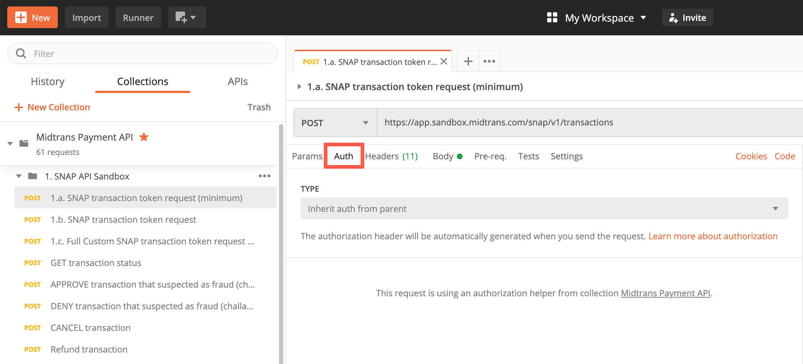

# Midtrans API Postman Collection
<hr>


[Postman](https://www.getpostman.com/) is a user-friendly tool that makes it easy for you to quickly send and test REST API requests without doing complex programming. Midtrans provides Postman Collection that you can import to test the Midtrans API in no time.

## Midtrans API Postman Collection
This Postman collection covers the following API:
* [Snap API](http://snap-docs.midtrans.com)
* [Core API](http://api-docs.midtrans.com)

### Usage Instructions

1. Download and open [Postman](https://www.getpostman.com).

2. Follow any of the steps given below to import Midtrans API collection. 

    - [Download from Postman](https://app.getpostman.com/run-collection/af068be08b5d1a422796).

    - GitHub Source: [Repo Link](https://github.com/midtrans/Midtrans-Payment-API-Postman-Collections).

    - Click **Run in Postman** button below, to download and import the collection.

      [](https://app.getpostman.com/run-collection/af068be08b5d1a422796)
      
        

3. [Register on Midtrans network](https://account.midtrans.com/register).

4. [Login](http://dashboard.midtrans.com) to Midtrans Merchant Administration Portal (MAP), and follow the steps given below to get the Server Key.

    1. Switch to **Sandbox** environment. 
    2. On the home page, go to **SETTINGS > ACCESS KEYS**. 
    3. Copy the **Server Key**.

5. In Postman, double-click to open **Midtrans Payment API** folder.

6. Click any request you want to try.

7. Select the **Auth** tab.

    

8. Select *Basic Auth* from the **TYPE** drop-down list.

9. Enter *Server Key* in the **Username** field.

10. Leave **Password** field blank.

11. Click **Send**.


The server response is displayed.

### Switching to Production Mode

All endpoints used in this postman collection are for transactions on Sandbox environment. To switch to transactions in Production environment, follow the steps given below.

1. Change endpoint URL from:

   `https://api.sandbox.midtrans.com/../..`to `https://api.midtrans.com/../..`

2. Update your *Server Key* with your production environment Server Key.

### Troubleshooting

If you encounter an error message similar to the one shown below,
```json
{
  "error_messages": [
    "Access denied due to unauthorized transaction, please check client or server key",
    "Visit https://snap-docs.midtrans.com/#request-headers for more details"
  ]
}
```
Please make sure to,
- Follow the steps 4 to 11 in **[Usage Instructions](#usage-instructions)** section properly.
- Use correct *Server Key*. The *Server Keys* for the Sandbox and Production environments are different.

## Midtrans Iris API Postman Collection
This Postman collection covers the Iris API.

### Usage instructions

1. Download and open [Postman](https://www.getpostman.com).

2. Click **Run in Postman** button below, to download and import the collection.

    [](https://app.getpostman.com/run-collection/f05d0d597076943acbb3)

3. Login to [Iris Midtrans Sandbox](https://app.sandbox.midtrans.com/iris/), and follow the steps given below to copy API Key.

    ​	1. Click your email address.

    ​	2. Copy your **API KEY**.

4. In Postman, click any request you want to try.

5. Select the **Auth** tab.

6. Select *Basic Auth* from the **TYPE** drop-down list.

7. Enter *Server Key* in the **Username** field.

8. Leave **Password** field blank.

9. Click **Send**.

    The server response is displayed.

### Switching to Production Mode
To switch to transactions in *Production* environment, follow the steps given below.

1. Change variable on the request URL from:

   `{{iris_base_url_sandbox}}` to `{{iris_base_url_production}}` 

2. Update your *Authorization* with your production environment *API Key*.

To switch to Production API URL, change variable on the request URL. And update your *Authorization* with production IRIS API_KEY.

